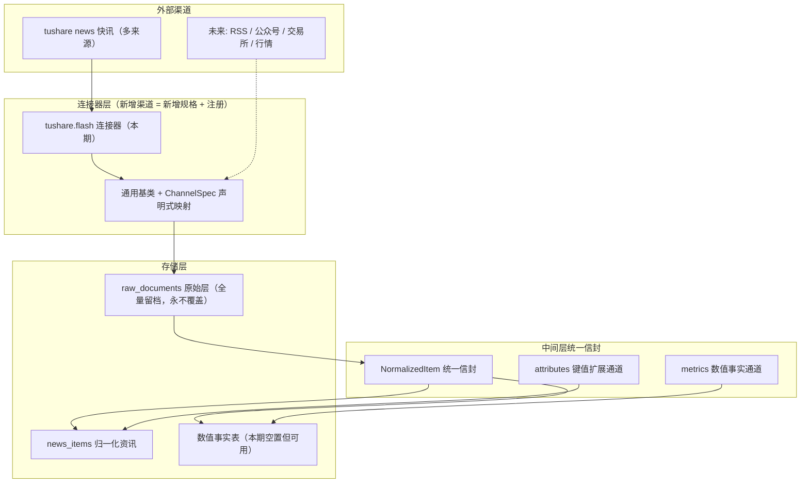
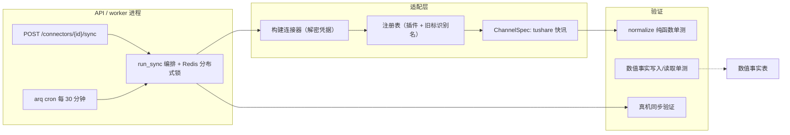

## 产品概述

把 tushare 的「新闻快讯」接口（doc_id=143）接成项目里第一个可用、可扩展的资讯渠道，并借此把数据源接入层从「面向新闻」升级为「面向任意渠道」——资讯类与市场数据类共用同一套中间层模型，未来接 RSS / 公众号 / 雪球 / 交易所公告 / 板块行情时只增不改。

## 核心功能

### 1. 修正并打通 tushare 快讯

- 现有实现对 `news` 接口的调用参数是错的（`src` 为必选却默认不传；时间格式用了 `%Y%m%d %H%M%S`，官方要求 `%Y-%m-%d %H:%M:%S`），这也是「同步成功但 0 条」假象的主要嫌疑。本次按官方规格修正。
- 单次上限 1500 条，按时间窗循环提取。
- 输出只有 `datetime / content / title / channels`，**没有 id、没有 src、没有 url**，因此幂等标识与渠道身份必须由我们自己构造。

### 2. 拆出独立的「快讯」连接器

- 新连接器只管快讯，与长文 / 公告 / 政策 / 研报类彻底分离，各自独立配置与权限探测。
- 一个连接器实例可配置多个新闻来源，同步时逐个来源循环拉取。
- 限流与断点续拉必须按来源分别管理——每个来源有独立的拉取进度，某个来源失败不拖累其他来源。
- 已有旧连接器的存量配置必须能平滑处理，不能因注册表标识变更导致服务启动即报错。

### 3. 渠道无关的中间层数据模型

- 中间层不再叫「News」，而是能同时承载新闻资讯与市场信息（行情、资金流等数值型数据）的通用信封。
- 标题不再是必填项（数值型数据没有标题）。
- 每个条目都带来源溯源信息：来自哪个连接器、哪个上游接口、哪个具体渠道、哪次抓取。
- 提供两个扩展通道：键值型的附加属性（承接上游诸如分类这样的字段）与数值型事实列表（承接可被引用、可被事实核对的量化数据）。
- 上游字段到统一信封的映射改成声明式配置，新增一个渠道只需声明映射，不必再手写一套转换逻辑，从机制上兑现「不改核心代码即可扩展」。
- 现有落库链路（原始层全量留档、两级去重、跨源命中时追加来源而非丢弃）保持不变。

### 4. 为市场信息预分流

- 新增独立的数值事实存储，把「某标的价格 = 7.4 万元/吨」这类可核查的量化数据与文本资讯分开存放，避免将来用文本表硬塞数值。
- 本期不接行情数据源，因此该存储会先空置——但表结构、落库路径与读取接口都要真实可用，不能是死代码。

## 视觉与交互

- 数据源管理页新增渠道来源的多选配置入口（当前页面创建连接器时不传任何配置，也没有配置编辑界面）。
- 连接器卡片上能看到每个新闻来源的可用状态（哪个来源有数据、哪个来源为空或无权限），而不是只有一个笼统的「接口无权限」。
- 同步结果在信息为空时继续给出人话原因（区分来源权限问题、时间区间无数据、非交易日）。

## 关键边界

- 本次只接 tushare 快讯一个来源；其他 tushare 接口保持现状。
- 不修改同步调度机制（每 30 分钟定时触发现状不变）。
- 不改动原始层留档与跨源去重语义（这是「多源交叉验证」的产品基础）。

## 技术选型

沿用既有技术栈，不引入新依赖：Python 3.12 + FastAPI + SQLAlchemy 2.0 async + Alembic + arq + pydantic v2（用于中间层模型的校验与序列化）；前端 React 19 + Vite + TypeScript + Tailwind v4 + TanStack Query。tushare SDK 已在依赖中。

## 实现方案

### 总体策略

分三层推进，每层可独立验证：

1. **中间层建模**（不动数据库）—— 抽象的准确性决定未来扩展成本，必须先把形状定对。
2. **tushare 快讯连接器 + 数值事实表**（动数据库）—— 用新连接器反证中间层设计是否真的能落库。
3. **前端配置入口 + 文档回填** —— 让配置能力真正对用户可见。

### 关键设计决策

**决策一：中间层用「统一信封 + 双扩展通道」，而不是给每种数据建一个模型**

统一信封承载所有渠道都有的字段（时间、来源、标题、正文、语言、溯源），两种数据在形状上的差异用两个通道吸收：

- `attributes: dict` —— 键值型元信息（上游分类、公告类型、政策发文单位等），不参与检索但可展示与回溯。
- `metrics: list[Metric]` —— 数值型事实列表，每个元素含 `name / value / unit / period / ts_code`，这是「事实可核查」的最小单元，将来自动词条的 quotation 与事实卡片都从这里取数。

这样「文本资讯」与「市场数值」走的是同一个模型骨架，而不是两棵树。选择理由：如果按数据类型分模型，每加一种数据类型就要加一条落库分支；而用双通道，落库分支数固定为「有 metrics / 无 metrics」。

**决策二：声明式字段映射（ChannelSpec），把「新增渠道 = 写代码」变成「新增渠道 = 写配置」**

现在每个连接器的字段映射都写在自己的 `normalize()` 里。抽象出 `ChannelSpec`，把上游字段路径映射到统一信封的各个字段，并提供少量可组合的取值器：

- 直接字段引用（`title` 字段来自上游 `title`）
- 多候选回退（上游不同接口字段名不一致时按序取第一个非空）
- 常量注入（上游没有但语义必需的，如渠道 `src`）
- 时间解析（声明该渠道的时间格式集合，交给统一的解析器）
- 静态标签（该渠道固定归属的市场范围、行业）

`normalize()` 保持纯函数契约（这是可回放、可单测的前提），由基类的通用实现根据 `ChannelSpec` 完成，具体连接器不再手写映射逻辑。

选择理由：声明式映射能同时解决三个问题——消除每个连接器里重复的字段映射代码、让字段变化只改一处、让新渠道不需要碰核心代码。代价是引入一层间接，需要通过单测锁定行为。

**决策三：`ContentType` 单一来源，消除重复定义**

现在 `connectors/base.py` 用 `Literal[8 个值]` 重复定义了 `models/enums.py` 的 `ContentType`。改为直接引用后者，避免两处漂移（历史上 `market_data` 已经在两边各写了一遍）。中间层新增枚举时只改 `enums.py` 一处。

**决策四：`NewsDraft` 保留为兼容别名，而不是立刻全量重命名**

中间层模型改名（去掉 News 前缀以涵盖市场信息）会波及连接器、仓储、服务、测试多处。采用「新名字为主 + 旧名字作为别名」的过渡：新代码用新名字，`NewsDraft` 保留指向同一个类的别名并标注 deprecated，避免一次性大范围改动带来的风险。等所有调用点迁完再删别名。

**决策五：多来源的游标存在既有 `SyncCursor.payload` 里，不改表**

`SyncCursor` 已经有 `payload: dict` 自由字段，多来源的独立进度可以放在 `payload` 下的一个按来源分组的子结构里。这样零迁移成本，且每个来源有自己的 `last_published_at` 与去重游标，满足「某个来源失败不拖累其他来源」。

**决策六：`external_id` 用「渠道 + 时间 + 标题」组合，不用全字段 hash**

上游没有 id 字段。现有实现用全字段 hash，导致上游分类字段一变就产生新 id、重复占原始层。改为由稳定字段组合派生（渠道标识 + 发布时间 + 标题），既保证跨次拉取幂等，又不会因为无关字段变化而漂移。原始层的 payload 仍然全量留档，不受影响。

**决策七：渠道身份三处落点，各有分工**

- `source_name` 取渠道中文名（新浪财经 / 财联社 / 同花顺…），这是用户可见的「来源」。
- 上游 `channels` 分类字段进 `attributes`，进而不参与检索但可回溯。
- 条目级的渠道标识（`src`）进溯源字段，用于按渠道统计与排查。

**决策八：数值事实表按长表建模，且本期必须有真实写入路径**

一行一个 metric（长表），便于任意扩展新的指标名而不改表结构。

- 主键 uuid，业务唯一性用部分唯一索引约束（沿用项目「唯一性一律用部分唯一索引、禁止把软删字段写进唯一约束」的规范）。
- 关键列：标的代码、指标名、数值、单位、周期、观测时点、来源连接器、原始条目外键、幂等键。
- 关联到原始层，保证与资讯条目一样可以回溯到原始 payload。
- 「本期表为空」的处理：不建死代码——通过一个显式的落库入口 + 一条单测覆盖写入与读取，使其成为经过验证的可用路径，只是暂时没有数据源调用它。同时明确记录「接行情数据源时需要做的下一步」。

**决策九：旧连接器标识必须平滑处理，否则服务启动即失败**

注册表在 `key` 变更后，数据库里已存在的旧 key 行会让取连接器类时抛 `LookupError`。方案：注册表侧支持别名解析（旧 key 映射到新类），且不新建旧类的 deprecated 子类（避免注册表里出现两个类争同一个功能）。同时在同步任务与 API 出参里保留旧 key 的可读性，给出「该连接器已迁移到 xxx」的人话提示。

**决策十：`probe_endpoints()` 按来源探测，且控制探测成本**

来源数量可配（最多 9 个），但探测不能 9 个都真拉一遍。策略：只探测配置中启用的来源，且探测窗口收紧（例如最近若干小时），并对每个来源区分三种结果——有数据 / 无权限（抛异常）/ 区间为空（返回 0 行不报错）。这样前端能显示「每个来源是否可用」而不是笼统的「接口无权限」。

### 性能与可靠性

- **调用量估算**：设配置了 N 个来源，单次同步调用数约为 N × 窗口分段数。当前 `hour` 粒度拉 24 小时 = 24 段，N=3 时约 72 次调用。需按来源独立限流（复用现有 token bucket，但计时器按来源隔离），否则会撞 tushare 频率限制。
- **单次 1500 条上限**：窗口内若触顶，需要继续按更细粒度切分或推进窗口，避免静默丢数据；判定方式为「返回行数达到上限阈值即视为可能截断」。
- **批量入库**：沿用现有「每 50 条提交一次」的节奏，避免长事务。
- **外部 IO 与事件循环**：tushare SDK 是同步的，继续用 `asyncio.to_thread` 包住，防止阻塞事件循环（API 与 worker 都是单进程单事件循环，一旦阻塞全站卡住）。
- **幂等**：原始层靠既有唯一约束；DWD 层靠内容哈希 + 稳定 external_id；数值事实层靠业务唯一索引。

## 实现要点（执行细节）

- **异步 ORM 陷阱**：本项目已踩过三次——`server_default` 与 `onupdate=func.now()` 的列在 `flush()` 后未回读就访问会抛 `MissingGreenlet`。新表的写入路径必须在写后回读；JSONB 落库前必须把 UUID 转成字符串，否则触发序列化错误。
- **迁移规范**：新迁移编号顺延（当前最新为 0004），新表若含更新时间字段需登记到既有的更新时间触发器列表中；pgvector 相关索引不要用自动生成，必须手写。
- **时间语义**：上游 `datetime` 无时区，而库中时间列是带时区类型。解析后必须显式按东八区加上时区信息再落库，避免跨环境按会话时区被隐式解释（这是现有实现的隐患，本次一并修正）。
- **原始层不可变**：数据源适配层不得修改或跳过原始层写入；跨源命中时继续追加来源信息，绝不丢弃。
- **注册表与导入链**：插件注册依赖包导入链（连接器包、workers 包、连接器总包三处的导入与导出），新增连接器时必须同步登记，否则能力声明接口会漏掉它。
- **测试不得静默跳过**：项目此前出现过因事件循环隔离问题导致集成测试被 skip 却显示通过的事故，新增测试需确保真实执行。
- **前端配置表单**：数据源页当前创建连接器时不传配置且无编辑入口。本期至少为快讯连接器提供来源多选；同时评估是否顺带实现「能力声明驱动的通用配置表单」，以真正兑现页面上「表单由能力声明动态渲染」的承诺——若评估后认为改动面超出本期范围，则先硬编码，并在文档中记录为待办，不要留下与文案不符的实现。
- **兼容性**：不破坏既有的连接器创建 / 校验 / 同步 / 删除接口契约与前端既有展示；`GET /connectors/available` 的返回结构若扩展需保持向后兼容。
- **性能红线**：单进程单事件循环，任何同步阻塞调用（tushare SDK、文件 IO）都要放入线程池；批量入库沿用分批提交。

## 架构设计

### 数据流（改造后）



### 组件关系



### 目录结构（仅列新增 / 修改）

```
apps/api/
├── app/
│   ├── connectors/
│   │   ├── base.py                      # [MODIFY] 中间层统一信封：NewsDraft 泛化为
│   │   │                                #   渠道无关模型 + attributes/metrics 双通道 +
│   │   │                                #   provenance 溯源 + ContentType 单一来源 +
│   │   │                                #   NewsDraft 兼容别名
│   │   ├── spec.py                      # [NEW] ChannelSpec 声明式字段映射 + 取值器
│   │   │                                #   （字段引用/多候选回退/常量注入/时间解析/静态标签）
│   │   │                                #   与通用 apply_spec() 归一化实现
│   │   ├── __init__.py                  # [MODIFY] 登记新连接器导入与 __all__
│   │   ├── tushare/
│   │   │   ├── __init__.py              # [MODIFY] 导出新连接器
│   │   │   ├── specs.py                 # [NEW] tushare 快讯的 ChannelSpec + src→中文名映射表
│   │   │   ├── flash.py                 # [NEW] tushare.flash 连接器：多 src 循环拉取、
│   │   │   │                            #   按 src 独立限流与游标、1500 条截断处理、
│   │   │   │                            #   按 src 探测、稳定 external_id
│   │   │   └── connector.py             # [MODIFY] 保留旧连接器实现（长文/公告等），
│   │   │                                #   复用新的时间解析与统一的 base 契约
│   ├── models/
│   │   ├── enums.py                     # [MODIFY] 如需新增内容类型/事实相关枚举
│   │   └── market.py                    # [NEW] 数值事实表模型（长表 + 业务唯一索引 +
│   │   │                                #   软删 + 原始条目外键 + 时间戳）
│   ├── repositories/
│   │   └── market_repo.py               # [NEW] 数值事实写入（幂等 upsert）+ 按标的/指标/时间查
│   ├── services/
│   │   ├── sync_service.py              # [MODIFY] 归一化后可分流：有 metrics 走事实表
│   │   └── ingest_service.py            # [NEW, 可选] 归一化结果落库编排（拆出以防 sync_service 膨胀）
│   └── api/v1/
│       └── connectors.py                # [MODIFY] 创建/更新连接器时接受 config（来源多选）；
│       │                                # 可用数据源出参附带配置 schema（供前端动态渲染）
│       └── market.py                    # [NEW] 数值事实读取接口（本期用于验证落库路径可用）
├── alembic/versions/
│   └── 0005_market_facts.py             # [NEW] 数值事实表 + 索引 + 时间戳触发器登记
└── tests/
    ├── test_flash_connector.py          # [NEW] normalize 纯函数单测：src→中文名、
    │                                    #   external_id 跨次稳定、时间 tz-aware、
    │                                    #   多候选字段回退、metrics 解析
    ├── test_market_fact.py              # [NEW] 数值事实写入幂等 + 读取（走真库）
    ├── test_connector_compat.py         # [NEW] 旧标识别名解析 + 注册表完整性
    └── test_smoke.py                    # [MODIFY] 更新受拆连接器影响的断言

apps/web/src/
├── lib/api.ts                           # [MODIFY] 连接器配置类型 + 创建/更新带 config 的接口
└── routes/Connectors.tsx                # [MODIFY] 来源多选配置 UI + 按来源展示探测结果

docs/
├── 04-architecture.md                   # [MODIFY] §4.2 中间层模型、§4.4/§4.4.1 快讯从
│                                        #   「返回 0 行」更正为可用、新增 ChannelSpec 与事实表
└── 05-database-schema.md                # [MODIFY] 新增数值事实表 DDL
```

## 关键代码结构

```python
# app/connectors/base.py（中间层统一信封，接口级定义）
class SourceKind(str, Enum):
    """条目的语义类别，决定落库分流：有 metrics 的走事实表。"""
    news = "news"            # 快讯 / 长文
    announcement = "announcement"
    policy = "policy"
    research = "research"
    social = "social"
    market = "market"        # 行情 / 资金流等数值型

class Metric(BaseModel):
    """可核查的最小量化单元，来自任何渠道的数值型信息。"""
    name: str                       # 指标名，如 "电池级碳酸锂均价"
    value: Decimal
    unit: str | None = None         # 万元/吨、%、亿元
    period: str | None = None       # 时点 / 区间标识
    ts_code: str | None = None      # 标的，标准码

class NormalizedItem(BaseModel):
    """渠道无关的统一信封。title 可选 —— 数值型数据没有标题。"""
    external_id: str
    kind: SourceKind
    content_type: ContentType                 # 单一来源：app/models/enums.py
    title: str | None = None
    summary: str | None = None
    content: str | None = None
    published_at: datetime                    # 必须 tz-aware
    lang: str = "zh"
    source_name: str | None = None
    url: str | None = None
    author: str | None = None
    symbols: list[str] = Field(default_factory=list)
    industries: list[str] = Field(default_factory=list)
    market_scope: list[str] = Field(default_factory=list)
    entities: list[dict] = Field(default_factory=list)
    attributes: dict = Field(default_factory=dict)   # 键值扩展通道
    metrics: list[Metric] = Field(default_factory=list)  # 数值事实通道
    provenance: Provenance                    # 哪个连接器/接口/渠道/哪次抓取
    extra: dict = Field(default_factory=dict)

# 兼容过渡
NewsDraft = NormalizedItem  # deprecated alias
```

```python
# app/connectors/spec.py（声明式映射，唯一需要"写"的地方）
class FieldRef(BaseModel):
    """取值器：从上游 payload 取一个字段，支持多候选回退与常量注入。"""
    candidates: list[str] = Field(default_factory=list)   # 按序取第一个非空
    constant: Any | None = None                           # 上游没有时注入

class ChannelSpec(BaseModel):
    """一个上游接口的字段映射声明。新增渠道只写这个，不写代码逻辑。"""
    api: str
    kind: SourceKind
    content_type: ContentType
    title: FieldRef | None = None
    content: FieldRef | None = None
    summary: FieldRef | None = None
    author: FieldRef | None = None
    url: FieldRef | None = None
    time: FieldRef                                   # 时间字段（多候选 + 格式集合）
    time_formats: list[str] = Field(default_factory=list)
    source_name: FieldRef | None = None
    attributes: dict[str, FieldRef] = Field(default_factory=dict)
    static_attributes: dict[str, Any] = Field(default_factory=dict)
    market_scope: list[str] = Field(default_factory=list)
    external_id_fields: list[str] = Field(default_factory=list)  # 稳定幂等键
```

## Agent Extensions

### Skill

- **tushare-data**
- Purpose: 项目内已有该 skill，用于认证并访问 tushare 数据服务。本方案需要在真机验证阶段用它确认 `news` 接口在用户已开通权限下的真实返回结构、字段名与 1500 条截断行为。
- Expected outcome: 得到一份真机返回样本（含 `datetime / content / title / channels` 的实际格式）与分来源的调用结论，用于锁定 `ChannelSpec` 的字段映射与时间解析格式集合，并把结果写回 `docs/04-architecture.md` §4.4.1 的实测结论表。

### SubAgent

- **code-explorer**
- Purpose: 在实施前把「拆连接器」的波及面一次性摸清——包括注册表导入链（连接器包/workers 包/连接器总包三处导出）、前端默认值与展示、测试断言、文档引用，以及数值事实表需要对齐的既有表规范与触发器登记方式。
- Expected outcome: 输出完整的「需要同步修改的文件清单 + 每处的具体改动点」，避免出现「改了连接器但注册表没登记导致能力声明漏项」或「测试因旧 key 断言失败」这类漏改。

### Integration

- 无（当前无与本任务相关的已连接集成）