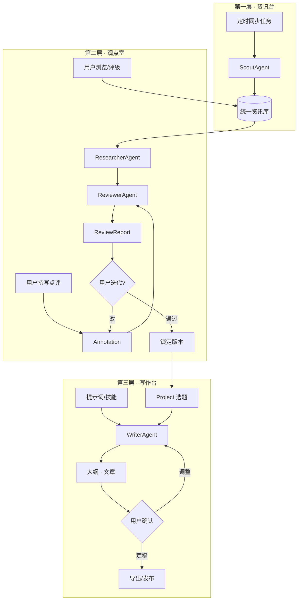

# 01 · 产品方案

## 1. 一句话定位

> **主理人 Agent** 是一个「观点驱动」的内容生产工作台：
> 用户每天只需对感兴趣的资讯写下碎片化判断，系统负责补齐事实、查错纠偏、按用户风格成文。

它不是一个"AI 写作工具"（那是 2023 年的产品形态），而是
**一个把人的判断力放大、把人的表达成本降到接近零的杠杆。**

---

## 2. 洞察：为什么现在做这个

### 2.1 三个正在发生的变化

| 变化 | 表现 | 对本产品的意义 |
| --- | --- | --- |
| **信息过载** | 财经/科技/社会资讯日更量级从"百条"到"万条"，主理人靠人力筛选成本极高 | 需要一个「资讯管家」做降噪与召回，而不是让用户刷 RSS |
| **写作贬值** | LLM 让"成文"这件事边际成本趋零，同质化内容泛滥 | 写作能力不再是竞争力，**"给出观点"才是** |
| **信任稀缺** | 读者对 AI 味内容疲劳；同时平台与监管要求 AI 内容可标识、可追责 | 只有"带真人观点 + 事实可核"的内容才有溢价 |

### 2.2 由此得到的产品定义

```
用户提供：观点（不可替代） + 风格（不可替代）
系统提供：资讯（可规模化） + 事实（可规模化） + 成文（可规模化） + 查错（可规模化）
```

**系统的价值 = 把"不可替代"的部分留给人，把"可规模化"的部分全部接管。**

### 2.3 反面案例（我们要避开什么）

- ❌ **"输入一个标题，AI 写一篇"**：产出无信息增量，用户不会认领为自己的作品。
- ❌ **"RAG 问答式写作助手"**：用户还是要自己组织语言，没省下最痛的那一步。
- ❌ **"全自动日更机器人"**：无人格、无观点、合规风险高，平台会打击。
- ✅ **本产品**：用户留下"今天的判断"，系统替他补齐事实、把判断淬炼成文。

---

## 3. 产品形态：主理人 Agent 是什么

### 3.1 三层产品结构

```
┌─────────────────────────────────────────────────────────────┐
│  第三层  「写作台」  Compose                                  │
│   提示词/技能管理 · WriterAgent · 流式写作 · 版本对比 · 导出    │
├─────────────────────────────────────────────────────────────┤
│  第二层  「观点室」  Review          ← 产品的灵魂              │
│   点评编辑器 · AI 体检报告 · 事实卡片 · 迭代修订 · 定稿锁定      │
├─────────────────────────────────────────────────────────────┤
│  第一层  「资讯台」  Curate          ← 数据底座               │
│   多源同步 · 归一化去重 · 聚类打标 · 兴趣召回 · 浏览/评级/收藏   │
└─────────────────────────────────────────────────────────────┘
```

三层可以在 UI 上表现为「今日收件箱 → 我的观点 → 我的稿子」三个主 Tab。

### 3.2 核心对象（产品语言）

| 对象 | 用户视角 | 系统视角 |
| --- | --- | --- |
| **资讯 (NewsItem)** | 今天刷到的一条新闻 | 归一化后的统一实体，带标签/实体/向量 |
| **点评 (Annotation)** | 我对这条新闻的看法 | 用户观点原文，可版本化，检查的输入单元 |
| **体检报告 (ReviewReport)** | AI 说我哪里有问题 | 结构化 findings 列表，可逐条采纳/驳回 |
| **事实卡片 (FactCard)** | 这条我引用的数据出处 | 可引用证据集，写作时作为 ground truth |
| **选题 (Project)** | 我今天想写的那篇文章 | 聚合 N 条资讯 + N 条点评的创作容器 |
| **提示词 (PromptTemplate)** | 我的写作风格要求 | 版本化的技能包，可被 Agent 按需加载 |
| **稿件 (Article)** | 我的文章 | 多版本产出物，可回溯到 run 与素材 |

### 3.3 关键产品决策

| 决策 | 选择 | 理由 |
| --- | --- | --- |
| 单条点评 vs 批量 | **支持批量（一次 5~10 条）** | 匹配真实工作流：主理人一次读完一批再统一表达 |
| 检查时机 | **用户主动触发**（不是输入时实时） | 实时检查会打断写作心流；主动触发让用户先表达完整 |
| 检查粒度 | **每条点评独立 + 项目级整体一致性** | 单条查事实/逻辑，整体查"多观点之间是否互相矛盾" |
| 是否允许跳过检查直接写作 | **允许，但强提示** | 老用户可能只想快速成文；风险自负并留审计 |
| 提示词 | **用户可管理多套 + 官方模板库** | 不同栏目/平台需要不同风格，且支持 A/B |
| 是否代替用户发布 | **M3 只做导出，M4 做发布对接** | 发布涉及平台合规，先不碰 |

---

## 4. Agent 形态设计

### 4.1 结论：为什么不是"一个大 Agent"

| 方案 | 问题 |
| --- | --- |
| 单 ReAct Agent 一把梭 | 流程不可控、不可复现、无法在中途让用户介入、出错难定位 |
| 纯 Chain / Prompt 拼接 | 无法处理"检查不通过 → 用户改 → 重查"这类循环 |
| 纯确定性工作流（无 LLM 决策） | 资讯打标、事实检索、写作规划都需要模型自主决策，写死不了 |
| ✅ **工作流骨架 + 专业子 Agent（本方案）** | 骨架保证可控与可干预，子 Agent 保证各环节的智能深度 |

### 4.2 四个子 Agent 的详细规格

#### A. `ScoutAgent` — 资讯管家（归属第一层）

- **形态**：轻量 DeepAgent（工具为主，规划为辅）
- **工具**：`fetch_news` / `dedupe_semantic` / `classify` / `extract_entities` / `cluster_event` / `score_importance`
- **关键设计**：
  - **两级去重**：`content_hash`（精确）+ `simhash`/向量（近似），聚类成「事件簇」，同一事件多源报道只展示代表条 + "另有 N 家报道"。
  - **打标三件套**：内容类型（快讯/长文/公告/政策/研报）、主题行业、关联标的（`600519.SH` 标准码）。
  - **重要度打分**：结合来源权威度、事件类型、市场影响、用户兴趣画像。
- **为什么用 Agent 而不是规则**：资讯形态千变万化（政策文件、公司公告、社交媒体），规则会无限膨胀。

#### B. `ResearcherAgent` — 事实研究员（归属第二层）

- **形态**：DeepAgent（**最能体现 subagent 价值的一个**）
- **任务（重要修订）**：产出**资讯级事实基线（FactCard）**，输入是「**一条资讯**」，**不含用户点评**。
  - **执行时机**：`ingest` 阶段**异步预生成**（资讯入库即入队），`review` 时**只读缓存**。
  - **修订原因**：原设计把 FactCard 定义为「资讯 + 点评」的产出，却又让它按 `news_item_id` 唯一复用——
    两者矛盾；且导致 review 必须同步跑完 4 个子代理，"检查单条 < 8s"物理上不可能达成。
  - **代价与补偿**：资讯级基线覆盖不到"点评里特有的断言"，这类断言由 `fact` 轨道在 review 时
    **按需补查**（结果写 `review_finding_evidence`，**不写回** `fact_cards`，避免污染复用基线）。
- **子代理拆分**：
  | 子代理 | 职责 |
  | --- | --- |
  | `market_probe` | 查该标的/板块/指数的行情与资金流（走 tushare connector） |
  | `filing_probe` | 查公告、财报、互动问答（`anns_d` / `income` / `irm_qa_*`） |
  | `policy_probe` | 查政策原文与宏观数据（`npr` / `cn_cpi` / `cn_pmi`） |
  | `timeline_probe` | 还原事件时间线（多源资讯聚类 + 历史新闻检索） |
  | **`web_probe`（新增）** | **网页检索 + 正文抓取**（Tavily / 博查）。★ 没有这一条，事实核查就被锁死在 tushare 覆盖范围里，P1 科技/产业博主（信息源在 X / arXiv / 公司博客 / GitHub）**完全服务不了** |
- **输出结构**（Pydantic）：
  ```python
  class FactItem(BaseModel):
      claim: str                       # 事实断言（原子化）
      status: Literal["verified", "contradicted", "unverifiable", "outdated"]
      evidence: list[Evidence]         # 来源 url / 接口 / 原文片段 / 时间
      confidence: float
  class FactCard(BaseModel):
      news_item_id: UUID
      facts: list[FactItem]
      context_notes: str               # 背景脉络
      related_symbols: list[str]
      open_questions: list[str]        # 还没查清的
  ```
- **硬约束**：**没有 evidence 的 claim 不允许标 `verified`**，只能标 `unverifiable`。这条规则决定了产品的事实可信度。

#### C. `ReviewerAgent` — 观点审稿人（归属第二层，**产品灵魂**）

- **形态**：LangGraph `Send` API 做 **map-reduce 并行轨道**，三条轨道互不干扰
- **三条检查轨道**：

  | 轨道 | 查什么 | 典型 finding |
  | --- | --- | --- |
  | **Fact** | 点评里的事实性断言是否与 FactCard / 外部证据一致 | "你提到'营收增长 30%'，但最新财报是 12%，可能混淆了季度与年度口径" |
  | **Logic** | 推理链是否成立：因果倒置、以偏概全、绝对化、前后矛盾、样本偏差 | "'因此必然上涨' 属于绝对化断言，建议改为'若 X 条件成立则倾向于…'" |
  | **Compliance / Tone** | 合规与语气：未证实指控、人身攻击、负面情绪、荐股/收益承诺、敏感话题、侵权引用 | "'这家公司就是骗局' 属未证实指控，有法律风险，建议改为'该业务的收入确认方式值得追问'" |

  > 第四条**可选轨道 `Uniqueness`**（观点是否有信息增量、是否只是复述新闻）放在 M4，因为需要与历史观点库比对。
- **输出结构**：
  ```python
  class Finding(BaseModel):
      type: Literal["fact", "logic", "compliance", "tone", "uniqueness"]
      severity: Literal["blocker", "high", "medium", "low", "info"]
      span_start: int; span_end: int          # 定位到点评原文的字符区间
      target: Literal["annotation", "news", "project"]
      message: str                            # 说人话的解释
      suggestion: str | None                  # 可直接替换的建议文本
      evidence: list[Evidence] = []           # 事实类 finding 必填
  class ReviewReport(BaseModel):
      annotation_version_id: UUID
      verdict: Literal["passed", "needs_revision", "blocked"]
      findings: list[Finding]
      summary: str
  ```
- **产品化要点**：
  - finding 必须**可定位**（`span_start/span_end`）→ 前端能划词高亮 + 一键采纳建议
  - `blocker` 级必须解决才能进入写作（合规红线），其余可带提醒继续
  - 支持「**驳回并说明理由**」→ 反馈进历史，用于后续降低误报（M4 做 per-user 偏好）
  - ★ **三轨必须用不同阈值**。验收指标里"事实误报率 < 15%"（要高精度）与"合规召回率 > 95%"
    （要高召回）在**统一阈值下互斥**，必须分开设定，并记录 `confidence` 供后续调阈值：

    | 轨道 | 取向 | 策略 |
    | --- | --- | --- |
    | `fact` | 高精度（宁可漏报） | 高阈值 + blocker/high 必须带 evidence |
    | `compliance` | 高召回（宁可误报） | 低阈值 + 红线词库优先命中 |
    | `logic` / `tone` | 折中 | 中阈值，`info` 默认折叠 |
- **跨条一致性检查**（项目级）：把 N 条点评的 finding 汇总后再跑一次轻量检查，捕捉"对 A 公司乐观、对同类 B 公司悲观但理由相同"这类矛盾。

#### D. `WriterAgent` — 主笔（归属第三层）

- **形态**：**完整 DeepAgent**，四支柱全部用上
  | DeepAgent 支柱 | 在本产品的具体用法 |
  | --- | --- |
  | **Planning（`write_todos`）** | 先产出大纲与写作计划，用户可在大纲阶段 `interrupt` 介入调整 |
  | **Sub-agents（`task`）** | `outline_writer` 定结构 / `section_writer` 逐段写 / `fact_checker` 复核引用 / `style_editor` 统一口吻 / `title_picker` 出标题 |
  | **Virtual Filesystem** | `/brief.md`（选题简报）、`/facts/*.md`（事实卡片）、`/style-guide.md`（风格）、`/outline.md`、`/draft/*.md`、`/final.md` |
  | **Skills** | 用户提示词模板 → 技能包，按栏目/平台**按需加载**（如 "雪球短评体"、"公众号深度体"） |
- **写作流水线**：
  ```
  素材装载 → 大纲生成 → [HITL 确认大纲] → 分段并行写作
        → 事实复核（对照 FactCard，禁止编造引用） → 风格统一 → 标题/摘要 → 终稿
  ```
- **硬约束（护栏）**：
  1. 文中每个事实句必须能映射到 FactCard 的某个 `FactItem`，否则降级为"观点句"或删除；
  2. 不生成 FactCard 中不存在的数字、日期、人名、机构名；
  3. 输出附带 `citation_map: {段落 → 资讯/证据}`，供"可追溯"要求。
- **交互形态**：SSE 流式；`/outline.md` 写完后 `interrupt` 等用户确认；用户也可在写作中途发指令（"第二段太啰嗦，压缩一半"）→ 走 `update_state` 续跑。

### 4.3 为什么必须 HITL（Human-in-the-loop）

本产品的产物是**要署用户名字、承担用户信誉**的文章。全自动生成 = 用户不敢发。
因此每个环节都是"AI 做到 80%，用户点一下"：

| 节点 | 用户动作 | 技术实现 |
| --- | --- | --- |
| 大纲 | 确认 / 调整结构 | LangGraph `interrupt()` + `Command(resume=...)` |
| 检查报告 | 采纳 / 驳回 / 忽略 | finding 状态机 + 重新生成点评版本 |
| 长篇写作 | 中途指令 | `update_state` 注入新 message 后续跑 |
| 终稿 | 编辑 / 重新生成某段 | 段落级重写（section writer 复用） |

### 4.4 Agent 编排总览



---

## 5. 功能模块清单

| # | 模块 | 核心功能 | 层 | 优先级 |
| --- | --- | --- | --- | --- |
| 1 | **数据源管理** | 连接器注册、凭据配置、同步计划、同步日志、能力声明 | L1 | M1 |
| 2 | **资讯中心** | 时间流/主题流视图、筛选（类型/行业/标的/来源/时间）、搜索、详情页、聚类展开 | L1 | M1 |
| 3 | **兴趣画像** | 关注板块/关键词/来源/内容类型、屏蔽词、画像可视化 | L1 | M1 |
| 4 | **互动与反馈** | 收藏、隐藏、已读、★评级（1-5）、快速点赞/点踩 | L1 | M1 |
| 5 | **点评工作台** | 批量选中、逐条点评、富文本、草稿自动保存、版本历史 | L2 | M2 |
| 6 | **AI 检查** | 三轨检查、结构化报告、划词高亮、一键采纳、驳回理由、复检 | L2 | M2 |
| 7 | **事实卡片** | 证据列表、来源链接、置信度、手动补充证据 | L2 | M2 |
| 8 | **选题管理** | 创建选题、聚合资讯+点评、排序、状态流转、备注 | L2/L3 | M3 |
| 9 | **提示词管理** | 多套模板、分类（风格/结构/人格/禁忌）、变量、版本、预览测试、官方模板库 | L3 | M3 |
| 10 | **AI 写作** | 大纲确认、流式写作、段落重写、中途指令、标题/摘要、配图建议 | L3 | M3 |
| 11 | **稿件管理** | 版本对比（diff）、人工编辑、状态（草稿/定稿/已发）、导出 MD/HTML/Word | L3 | M3 |
| 12 | **可追溯视图** | 文章 → 段落 → 点评 → 资讯 → 证据 的反向链路 | L3 | M3 |
| 13 | **观点库** | 历史观点沉淀、检索、复用、观点演化时间线 | 全部 | M4 |
| 14 | **多平台改写** | 一篇长文 → 公众号/雪球/微博/小红书 多版本 | L3 | M4 |
| 15 | **发布对接** | 公众号草稿箱、平台 API（视合规） | L3 | M4 |
| 16 | **用量与配额** | token 消耗、任务次数、成本看板 | 全部 | M3 |

---

## 6. 非功能要求

| 维度 | 要求 | 落地方式 |
| --- | --- | --- |
| **合规** | AI 生成内容可标识；不产出投资建议/荐股；不产出未证实指控 | 系统级提示词 + `compliance` 轨道 + 发布时强制标识开关 + 审计日志 |
| **可追溯** | 任意文章可回溯到素材与 run | `article_versions.citation_map` + `agent_runs` 关联 |
| **幂等** | 重复同步不产生脏数据 | `unique(connector_id, external_id)` + `content_hash` upsert |
| **成本** | ★ 单位经济性必须为正：单篇总成本 ≤ 售价的 20% | 模型分级（打标/聚类用 DeepSeek-V3 / Qwen-Plus，检查/写作用强模型）+ FactCard **资讯级预生成复用**（最大一项优化）+ embedding 缓存 + **硬配额上限**（超额直接拒绝，不是软提示） |
| **延迟** | 检查单条 < 8s；首字流式 < 2s | 8s 的**前提是 FactCard 预生成后只读缓存**（见 §4.2 B 修订）；并行 map-reduce + 流式 SSE + Redis 缓存热点上下文 |
| **并发上限** | 单批检查并发 ≤ 5 条 | 20 条批量排队而非同时打满 LLM，避免限流与成本尖峰（超时阈值仍为 60s/条） |
| **限流** | tushare 积分/频率限制 | connector 内建 token bucket + 分段拉取 + 增量游标 |
| **失败可恢复** | 长任务中断不丢进度 | LangGraph Postgres checkpointer + `sync_runs` 分段记录 |

---

## 7. MVP 与迭代路线

### M0 · 假设验证（3~5 天，**零代码**，M1 之前必做）

整个 M1~M3 押在一个未验证的行为假设上：**"用户愿意先写下 5~10 条碎片点评"**。
`02-audience.md` §9 把它列为"需要重点设计的摩擦点"，但只给了 UI 缓解（AI 提示问题、语音输入）——
那是缓解，不是验证。

- [ ] 找 **20 个种子主理人**做 Wizard-of-Oz（人工扮演 AI 出体检报告，不下场写代码）
- [ ] 验证三件事：① 是否愿意写；② 一次实际写几条；③ 检查建议采纳率能否到 50%
- [ ] 顺带验证：他们更愿意"打字"还是"语音碎片转写"（影响 M2 编辑器形态）
- **Gate**：②③ 不达标则回到产品定义，不进 M1

> 这是投入产出比最高的 3~5 天。若假设不成立，后面 8 周的投入方向是错的。

### M1 · 数据底座（2 周）

- [ ] `uv` 项目骨架、FastAPI、SQLAlchemy 2.0 async、Alembic 首个迁移
- [ ] **数据源抽象层**（`DataSource` Protocol + Registry + `NewsItem` 统一模型）
- [ ] **TushareConnector**（`news` 快讯 / `major_news` 长文 / `anns_d` 公告 / `npr` 政策 / `research_report` 研报）
- [ ] ODS 落库 → 归一化 → 两级去重 → 打标（规则 + LLM）
- [ ] 定时同步（arq cron）+ `sync_runs` 日志 + 增量游标
- [ ] 前端：资讯流页面 + 筛选 + 详情 + 收藏/评级
- **验收**：连续 3 天自动同步，日增 500+ 条，重复率 < 2%，页面响应 < 300ms

### M2 · 观点闭环（3 周）

- [ ] 点评编辑器（Tiptap）+ 自动保存 + 版本表
- [ ] **ResearcherAgent**（4 个子代理）+ FactCard 落库
- [ ] **ReviewerAgent**（fact / logic / compliance 三轨并行）+ `ReviewReport`
- [ ] 检查报告 UI：划词高亮、severity 排序、一键采纳建议、驳回理由
- [ ] `blocker` 拦截逻辑 + 复检流程
- [ ] **`compliance_rules` 红线词库**（原排 M4，**提前到 M2**——合规轨道的核心交付依赖它）
- [ ] **评测数据集 + 回归流水线**（事实 100 条 / 逻辑 50 条 / 合规红线 50 条，接 LangSmith dataset）
      ——改一次 prompt 就可能让误报率翻倍，没有 golden set 靠人工抽查发现不了
- [ ] `fact_cards` / `fact_card_claims` 建表 + **ingest 阶段异步预生成事实基线**
- **验收**：50 条真实点评样本，事实类误报率 < 15%，合规红线召回率 > 95%（**三轨分别统计**，见 §4.2 C）

### M3 · 自动写作（3 周）

- [ ] 提示词管理（CRUD + 版本 + 分类 + 变量 + 测试预览）
- [ ] 提示词 → **Skill 包**编译（`SKILL.md` + 结构化约束）
- [ ] **WriterAgent**（DeepAgent：planning + subagent + 虚拟 FS + skills）
- [ ] 大纲 `interrupt` HITL 确认 → 分段写作 → 事实复核 → 风格统一
- [ ] 流式写作 UI、段落重写、版本 diff、导出 MD/HTML
- [ ] 可追溯视图
- **验收**：1000 字文章 < 90s；引用零编造（人工抽查 20 篇）；用户"几乎不用改"率 > 50%

### M4 · 沉淀与扩展（持续）

- [ ] 观点库 + 观点演化时间线 + 复用
- [ ] `uniqueness` 检查轨道（对接历史观点库）
- [ ] 第二数据源（RSS / 公众号 / 雪球 / 交易所）+ 板块行情数据
- [ ] 多平台改写 + 发布对接
- [ ] 风格自学习（从用户人工编辑的 diff 中提取偏好，反哺提示词）

---

## 8. 成功指标

| 层级 | 指标 | 目标（M3 结束时） |
| --- | --- | --- |
| 北极星 | **周产出可发布文章数** | ≥ 5 篇/周/用户 |
| 激活 | 首周完成"点评 → 检查 → 成文"全链路 | ≥ 60% |
| 粘性 | 周活跃天数 | ≥ 4 天 |
| 质量 | 成稿人工编辑率（改动字数占比） | ≤ 30% |
| 质量 | 事实类硬伤率 | ≤ 1%（人工抽查） |
| **成本** | **单篇总成本（检查 + 写作）** | **≤ ¥3**（M3 实测后回填；超标即触发定价调整） |
| 效率 | 单篇从选题到定稿耗时 | ≤ 30 分钟 |
| 信任 | 检查建议采纳率 | ≥ 50% |

---

## 9. 风险与应对

| 风险 | 影响 | 应对 |
| --- | --- | --- |
| **事实核查不准（幻觉）** | 用户信任崩塌 | 强制 evidence 绑定；无法验证标 `unverifiable` 而非猜测；展示置信度而非二元结论 |
| **检查误报过多** | 用户关掉功能 | 分 severity 呈现，`info` 默认折叠；支持"驳回并学习"；上线前用真实样本调阈值 |
| **写作"AI 味"重** | 用户不认领作品 | 风格技能包 + few-shot 用户历史成稿 + `style_editor` 子代理 + 禁止套话词表 |
| **合规事故** | 法律风险 | `compliance` 轨道 + 红线词库 + 发布强制 AI 标识 + 完整审计日志 |
| **tushare 权限/积分不足** | 数据断供 | 抽象层保证可换源；提前探测接口权限并降级；缓存热点数据 |
| **成本失控** | 单位经济性差 | 模型分级 + 事实卡片复用 + 聚类去重减少重复计算 + 缓存 embedding |
| **用户不愿写点评** | 产品飞轮不转 | **M0 先用 20 人 Wizard-of-Oz 验证**（见 §7）；降低门槛：一句话/语音转写；"AI 提示问题"引导；但**不代写观点** |
| **★ 单位经济性为负** | 卖一单亏一单 | 定价 ¥99~199/月含"无限检查 + 写作"，而日更用户月成本量级 ¥100~400。**M1 就有 `usage_records` 台账 + 硬配额；M3 前用 Spike #7 实测单篇成本并回填定价**。必要时改为次数分档（如 30 次检查 + 8 篇/月） |
| **★ 事实核查被锁死在 tushare 内** | P1 科技博主服务不了，海外源无解 | 新增 `web_probe` 子代理（网页检索 + 抓取），见 §4.2 B |
| **工期低估** | 8 周变 16 周，信心崩塌 | 甘特图 a1~c3 已 51 工作日（≈10 周）且**不含前端、测试、Spike**。现实区间 12~16 周（单人全栈）。对策：砍 M3 范围（首版不做多平台改写/版本 diff，只做 MD 导出）或 2 人并行（前端可独立用 mock 开工） |
