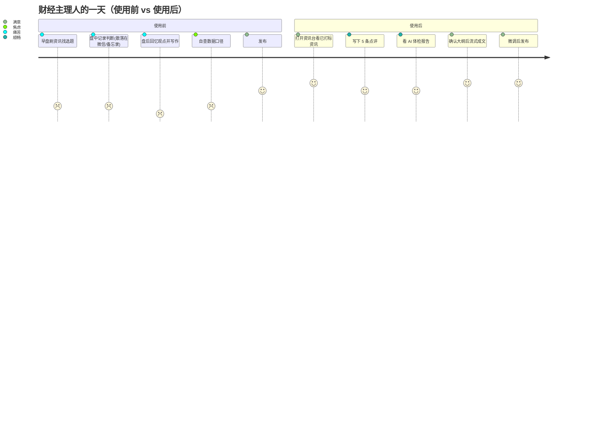

# 02 · 受众分析

## 1. 一句话结论

> 本产品的**核心受众是「日更型内容主理人」**——有稳定观点输出压力、有明确人格标签、
> 但被"读资讯 + 组织语言"这两件苦力活拖住的人。
> 其中**财经投研类**优先级最高（与 tushare 数据源天然契合），**科技产业类**次之，**泛资讯类**最后。

---

## 2. 受众分层与优先级

### 2.1 优先级矩阵

| 优先级 | 人群 | 数据契合度 | 痛点强度 | 付费意愿 | 获取难度 |
| --- | --- | --- | --- | --- | --- |
| **P0** | 财经/投研自媒体主理人 | ★★★★★ | ★★★★★ | ★★★★☆ | ★★★☆☆ |
| **P0** | 券商/基金 分析师 & 内容运营 | ★★★★★ | ★★★★☆ | ★★★★★ | ★★★★☆ |
| **P1** | 科技/产业观察博主 | ★★★☆☆ | ★★★★☆ | ★★★★☆ | ★★★☆☆ |
| **P1** | 独立创作者 / 一人公司 | ★★★★☆ | ★★★★★ | ★★★☆☆ | ★★★☆☆ |
| **P2** | 泛资讯/社会话题写手 | ★★☆☆☆ | ★★★★☆ | ★★☆☆☆ | ★★☆☆☆ |
| **P2** | 企业 PR / 市场 / 内部知识管理 | ★★★☆☆ | ★★★☆☆ | ★★★★★ | ★★★★☆ |

---

## 3. P0-1 · 财经/投研自媒体主理人（核心用户）

### 画像

| 项目 | 描述 |
| --- | --- |
| 典型身份 | 公众号"XX 投研笔记"、雪球大 V、知识星球主理人、视频号财经博主 |
| 规模 | 粉丝 1 万 ~ 50 万，1~3 人团队或单干 |
| 日常 | 早盘前刷资讯 → 盘中记录判断 → 盘后写复盘/深度稿 |
| 产出 | 日更或隔日更，单篇 1500~4000 字 |
| 工具现状 | 微信 + 自建 Excel + Notion + 手动翻公告 + 纯手写 |

### 痛点（按痛感排序）

1. **信息筛选成本极高** — 一天要看几百条快讯、几十份公告，真正相关的不到 5%。
2. **"看到了但没记下来"** — 盘中凭直觉的判断没有沉淀，写稿时要重新回忆，观点丢失。
3. **写作耗时** — 有观点但组织成 3000 字要 2~3 小时，挤占研究时间。
4. **怕说错** — 引用错了数据/口径（季度 vs 年度、母公司 vs 合并），被粉丝或同行抓到，信誉受损。
5. **合规焦虑** — 怕写成"荐股"、怕情绪化表述被平台限流。

### 本产品对他的价值

```
他把"今天的 5 个判断"写成 5 条点评（15 分钟）
    → 系统补齐事实、指出口径错误和绝对化表述
    → 按他的风格生成一篇有观点、有数据、像他口吻的稿子（另 15 分钟）
    → 他只需审阅 5 分钟即可发布
```

**他会为"省下的 2 小时/天 + 不丢观点 + 不被抓错"付费。**

### 付费意愿

| 档次 | 定价 | 内容 |
| --- | --- | --- |
| 免费 | 0 | 资讯浏览 + 每日 3 条点评检查 |
| 专业版 | ¥99~199/月 | 无限检查 + 写作 + 提示词管理 |
| 团队版 | ¥599+/月 | 多人协作 + 多账号风格 + 合规审计 |

参照：一个日更主理人靠内容变现月入 1 万~10 万，¥199/月 属"零头成本"。

> **★ 定价前置约束**：以上分档是**收入侧**假设，必须与**成本侧**对齐后才能定稿。
> 单次检查（20 条批量）与单篇写作的 token 成本尚未实测，量级可能在 ¥3~20 / ¥1~6。
> 日更用户的月成本量级可能达到 ¥100~400 —— 若"无限检查 + 写作"，¥199/月 是亏损的。
> **M1 建 `usage_records` 台账与硬配额；M3 前用 Spike #7 实测单篇成本，再决定是否改为次数分档**
> （如专业版 30 次检查 + 8 篇写作/月）。

### 反常识洞察

**主理人最抗拒的不是"AI 帮我写"，而是"AI 写了我说不出的话"。**
所以产品第一优先是**观点忠实度**，第二才是文笔。若 AI 生成的稿子有一句不是他的意思，
他会整篇弃用——这决定了 `WriterAgent` 的护栏设计（见 `01-product-plan.md` §4.2 D）。

---

## 4. P0-2 · 券商/基金 分析师 & 内容运营

### 画像

- 卖方分析师、买方研究员、基金公司市场部内容岗、券商投顾
- 有强合规约束（每篇稿子要过合规审核）
- 产出频率高（晨会纪要、周报、路演要点、公众号投教）

### 痛点

1. 合规红线多且动态变化，人工自查不可靠。
2. 同一份研究内容要改写成多个版本（晨会 / 公众号 / 朋友圈 / 直播话术）。
3. 团队内风格不统一，机构品牌调性难保证。

### 价值主张

- **合规轨道前置** — 写作前就把违规表述拦掉，减少合规返工。
- **批量改写** — 一份底稿多平台适配（M4）。
- **机构风格包** — 统一术语与口吻。

### 关键差异

这类客户要求**私有化部署 / 数据不出域 / 审计留痕**，架构上要提前预留
（`05-database-schema.md` 的 `audit_logs`、`agent_runs` 即为审计基础）。

---

## 5. P1 · 科技/产业观察博主

- 关注 AI、半导体、新能源、机器人等赛道
- 信息源以海外（X / arXiv / 公司博客 / GitHub）为主，tushare 只覆盖一小部分
- **对本产品的要求**：数据源必须可插拔（RSS / X / 掘金 / Hacker News），
  这是"多数据源抽象"设计的直接业务驱动（见 `04-architecture.md` §4）
- 价值主张同 P0，但需要更多"自由文本资讯"而非结构化行情

---

## 6. P1 · 独立创作者 / 一人公司

- 同时经营多个平台，内容形态多样（长文 / 短评 / 视频脚本）
- 预算敏感但付费意愿来自"别无选择"（一个人干十个人的活）
- 对"提示词管理"诉求最强 —— 不同平台不同人设，需要多套风格包
- **这是最可能成为口碑传播者的群体**（社群密度高）

---

## 7. P2 · 泛资讯/社会话题写手

- 内容不依赖结构化金融数据，tushare 价值低
- 平台敏感度高（社会新闻合规风险大）
- **不作为 MVP 目标**，但架构上不排斥（`content_type` 枚举已预留 `social_post`）
- 该群体的价值：验证 `compliance` 轨道在非财经场景的通用性

---

## 8. P2 · 企业 PR / 内部知识管理

- 场景：品牌内容生产、竞品情报、行业简报
- 付费意愿最高但销售周期长、定制化重
- **作为 M4+ 的商业化方向**：把"资讯 → 观点 → 稿件"链路改造成
  "情报 → 判断 → 简报"，复用同一套架构

---

## 9. 用户旅程与关键摩擦点



### 需要重点设计的摩擦点

| 摩擦点 | 现象 | 设计对策 |
| --- | --- | --- |
| 首日冷启动 | 不知道看什么 | 默认兴趣画像预置（沪深300 成分 + 宏观 + 政策）+ 热门榜 |
| 写点评的门槛 | 面对空白框发呆 | 提供"AI 提示问题"（不代写）；支持语音输入转文字 |
| 检查报告太啰嗦 | 一堆低优警告 | severity 分层，`info` 折叠，只推 `blocker/high` |
| 生成稿不满意 | 不知道从哪改 | 段落级重写 + "这段不像我" 反馈按钮 |
| 存量风格迁移 | 新用户没有历史稿 | 支持粘贴 3~5 篇旧作，自动提取风格画像生成初始提示词 |
| **★ 愿不愿意写点评** | 这是整个产品的飞轮起点，但目前只是假设 | **M0 用 20 个种子主理人做 Wizard-of-Oz 验证**（人工扮演 AI 出体检报告），确认：愿意写？一次写几条？建议采纳率能到 50% 吗？不达标则不进 M1（见 `01-product-plan.md` §7 M0） |

---

## 10. 不服务谁（明确排除）

| 排除对象 | 原因 |
| --- | --- |
| 想"一键生成 100 篇文章做矩阵号"的用户 | 与产品理念（观点驱动）根本冲突，会污染产品定位 |
| 需要毫秒级交易信号的量化用户 | 使用 tushare 但场景是数据管道，不是内容生产 |
| 纯英文内容创作者 | 数据源与合规模型均以中文为主 |
| 只想要"AI 摘要新闻"的用户 | 不需要观点层，用通用 AI 工具即可 |

---

## 11. 获客路径

| 渠道 | 打法 |
| --- | --- |
| 内容自证 | 用本产品日更一个账号，把"主理人日记"做成公开案例 |
| 社群渗透 | 知识星球、雪球、即刻、AI 工具社群，找 20 个种子主理人共创 |
| 开源引流 | 数据源抽象层 + tushare connector 开源，吸引金融 dev 用户 |
| 场景词 SEO | "复盘怎么写"、"投研笔记模板"、"公告解读工具" |
| 平台合作 | 与财经 MCN、券商内容团队合作，切入团队版 |
