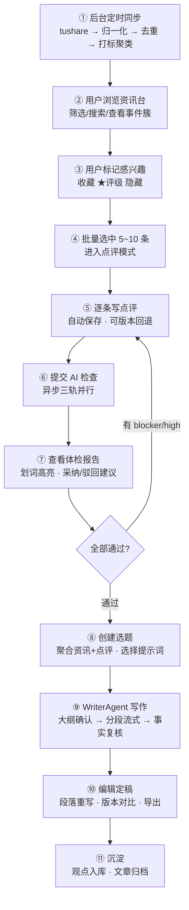
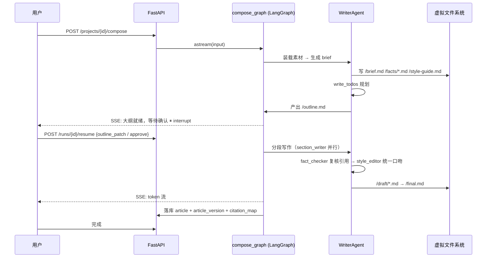
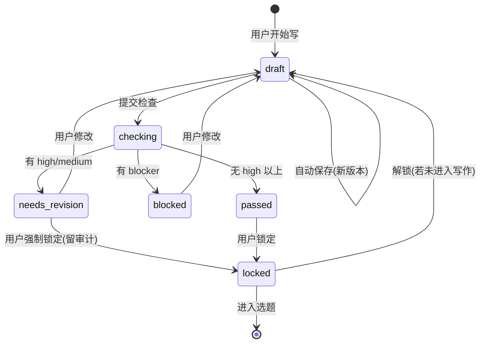
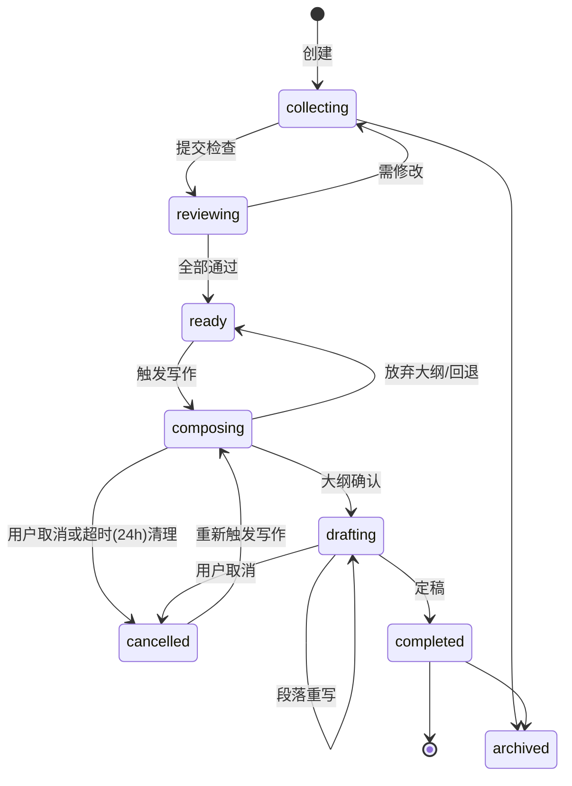

# 03 · 使用流程

## 1. 角色与前置准备

| 角色 | 说明 |
| --- | --- |
| **主理人（用户）** | 本产品的唯一主动操作者 |
| **系统（后台）** | 定时同步资讯、自动打标聚类、执行 Agent 任务 |

### 1.1 首次使用（Onboarding，目标 < 5 分钟）

1. 注册 / 登录
2. **配置兴趣画像**：选择关注的市场（A股/港股/美股/宏观）、行业板块、内容类型、屏蔽词
3. **配置数据源**：默认启用 Tushare（已有平台 token）；可选填自己的 token
4. **建立风格资产（二选一）**：
   - 快速：从官方模板库选一套（"雪球短评体" / "公众号深度复盘体" / "政策解读体"）
   - 进阶：粘贴 3~5 篇历史文章 → 系统提取风格画像 → 生成初始提示词草稿
5. 完成 → 系统立即触发一次历史资讯回填（近 7 天）

---

## 2. 主流程（端到端 11 步）



> 步骤 ① 是无人值守的后台流程，②~⑤ 是第一层「资讯台 + 观点室」，⑥⑦ 是第二层核心，⑧~⑪ 是第三层。

---

## 3. 分步详细说明

### 步骤 ① · 后台资讯同步（无用户交互）

**触发**：arq cron，交易日每 30 分钟；非交易日每天 2 次。

**执行链路**：

```
Scheduler
  → 读取启用的 connectors（按 next_run_at）
  → 为每个 connector 创建 sync_run（status=running）
  → Connector.fetch(cursor) → RawItem 流
       ↓ 写入 raw_documents（ODS，原始 payload 全量留档）
  → Normalizer.normalize(raw) → NewsItem（统一模型）
       ↓ content_hash 精确去重 → simhash/向量近似去重 → 事件聚类
  → Enricher：分类打标（规则 + 小模型）→ 实体抽取 → 关联标的 → 重要度打分
       ↓ upsert news_items + news_item_tags + news_item_symbols + embedding
  → ★ 跨源命中 content_hash：追加 source_refs + duplicate 关联 + 簇 source_count（**不可丢弃**）
  → ★ 异步入队生成「资讯级事实基线 FactCard」（review 时只读缓存，这是"检查 < 8s"的前提）
  → 更新 connector cursor → sync_run(status=success/partial/failed, stats)
  → 兴趣召回：命中用户画像的资讯推入「我的收件箱」
```

**用户可见**：资讯台顶部显示"刚刚更新 · 新增 128 条"。同步异常时显示轻提示，不阻塞使用。

**失败处理**：

| 情况 | 行为 |
| --- | --- |
| 部分分段失败 | `status=partial`，记录失败分段，下次从断点续拉，UI 显示"部分数据延迟" |
| 接口限流（429） | 指数退避重试，最多 3 次，仍失败则跳过该次并在下次补偿 |
| 权限/积分不足 | `status=failed`，在「数据源管理」页高亮"当前 token 无 XX 接口权限" |
| 全文为空 | 区分「非交易日 / 区间无数据 / 权限不足」，给出人话说明 |

### 步骤 ② · 浏览资讯台

**页面元素**：

| 区域 | 内容 |
| --- | --- |
| 左侧导航 | 今日收件箱 / 全部资讯 / 事件簇 / 我的收藏 / 观点室 / 写作台 |
| 顶部筛选条 | 时间（今日/3天/本周/自定义）、内容类型、市场、行业、来源、重要度、已读状态 |
| 主列表 | 卡片流，每张卡显示：来源 + 时间 + 标题 + 摘要 + 标签 + 关联标的 + 重要度徽标 + 聚类角标（"另 4 家报道"） |
| 快捷操作 | ★ 评级（1-5）、收藏、隐藏、屏蔽同类、选中复选框 |
| 详情抽屉 | 全文 / 原文链接 / 关联公告 / 关联行情小图 / 相关历史资讯时间线 |

**关键交互**：

- **事件簇折叠**：同一事件的 N 条报道合并为一张卡，展开可看各源差异（对"事实交叉验证"很有用）。
- **重要度徽标**：`重要`（红）/`一般`（灰）/`参考`（浅），由重要度打分映射，避免用户被信息量淹没。
- **快捷键**：`j/k` 上下移动、`s` 收藏、`1~5` 评级、`space` 选中 → 支持全键盘操作（重度用户的效率生命线）。

### 步骤 ③ · 标记感兴趣

用户动作产生 `user_news_actions` 记录（read / star / rating / hide / block_topic），
这些行为数据有两个用途：

1. **即时**：影响"今日收件箱"的排序。
2. **长期**（M4）：作为兴趣画像自学习的训练信号；也是 `uniqueness` 检查轨道的素材。

### 步骤 ④ · 批量进入点评模式

**入口**：主列表勾选 5~10 条 → 底部浮层出现「写点评 (N)」按钮 → 进入点评工作台。

**设计约束**：

| 约束 | 说明 |
| --- | --- |
| 单批上限 | 20 条（超过则提示分批，避免一次检查任务过重） |
| 支持混合类型 | 社会新闻 + 财经新闻可混选（与你描述的用法一致） |
| 保留上下文 | 右侧常显资讯原文/摘要，左侧写点评，不需要来回切页 |
| 可只写部分 | 未写点评的条目不进入检查与写作，但保留在选题里作为"背景事实" |

### 步骤 ⑤ · 撰写点评

**编辑器能力**：Tiptap 富文本，支持加粗/列表/引用/插入数据；**自动保存（3s 防抖）**；
每次保存生成 `annotation_versions` 快照。

**辅助（不代写）**：

- 「AI 提示问题」按钮：根据资讯内容生成 3 个引导性问题
  （例："这个政策对哪类公司是实质利好？"），**只提问不给答案**。
- 「关联标的」自动识别：点评里提到公司名 → 提示是否关联到标准代码。
- 「引用事实」：一键把 FactCard 里的数据以引用形式插入，避免手抄错数字。

**状态**：`draft` → （提交检查）`checking` → `needs_revision` / `passed` → `locked`

### 步骤 ⑥ · 提交 AI 检查

**交互**：底部「提交检查」按钮 → 后端创建异步任务 → 前端展示进度条（按条目推进）。

**进度反馈**：SSE 推送 `review.started` / `review.item_done` / `review.finished`，
用户可继续浏览其他页面，完成后右上角通知。

**后台执行**：

```
review_graph
  ├─ 并发对每条 annotation：
  │    ├─ [轨道 A] ReviewerAgent.fact      ← 依赖 ResearcherAgent 产出的 FactCard
  │    ├─ [轨道 B] ReviewerAgent.logic
  │    └─ [轨道 C] ReviewerAgent.compliance
  │    （三者由 LangGraph Send API 并行派发，互不阻塞）
  ├─ 汇总 → 项目级跨条一致性检查（轻量）
  └─ 生成 ReviewReport → 计算 verdict
```

**verdict 规则**：

| verdict | 条件 | 前端表现 |
| --- | --- | --- |
| `passed` | 无 `blocker`、无 `high` | 绿色 ✅，可进入写作 |
| `needs_revision` | 有 `high` 或 `medium` | 黄色 ⚠️，可写作但强提示 |
| `blocked` | 有 `blocker` | 红色 ⛔，**禁止进入写作**，必须修改 |

### 步骤 ⑦ · 查看与处理体检报告

**报告 UI 结构**：

```
┌── 体检报告  ·  7 条点评  ────────────────────────────┐
│  总评：3 条通过 · 2 条需修改 · 2 条有合规红线          │
├─────────────────────────────────────────────────────┤
│  ⛔ [合规] "这家公司就是骗局"                          │
│     未证实指控，存在法律风险                           │
│     建议：「该业务的收入确认方式值得追问」   [采纳][驳回]│
│                                                     │
│  ⚠️ [事实] "营收增长 30%"                             │
│     最新财报为 12%，疑似混淆季度/年度口径               │
│     证据：《2026Q2 财报》anns_d · 2026-08-28  [查看]    │
│     [采纳建议] [保留原文] [标记已确认]                  │
│                                                     │
│  💡 [逻辑] "因此必然上涨"                              │
│     绝对化断言，建议改为条件句                          │
│     [采纳][驳回][收起]                                │
└─────────────────────────────────────────────────────┘
```

**关键交互**：

| 操作 | 行为 |
| --- | --- |
| **划词高亮** | 点评正文中 `span_start/span_end` 区间高亮，severity 决定颜色 |
| **采纳建议** | 用 `suggestion` 替换原文本，生成新的 `annotation_version`，finding 标 `accepted` |
| **驳回** | 必填理由（用于后续降误报），finding 标 `dismissed`，**记住"已确认"不再重复报** |
| **查看证据** | 弹出证据面板：来源、时间、原文片段、置信度、原文链接 |
| **复检** | 修改后可只复检变更条目（增量），不必全量重跑 |

### 步骤 ⑧ · 创建选题

**入口**：报告通过后 →「创建选题并写作」/ 或在写作台手动创建。

**选题组成**：

| 字段 | 说明 |
| --- | --- |
| 标题（暂定） | 用户填写或 AI 建议 |
| 素材 | 已通过检查的点评（必需）+ 其他资讯（可选，作背景事实） |
| 目标平台 | 公众号 / 雪球 / 微博 / 小红书 → 影响字数与结构 |
| 提示词 | 从提示词库选择（可多选组合：人格 + 结构 + 禁忌） |
| 写作要求 | 字数、读者对象、必须包含的观点、禁止提到的内容 |
| 附加素材 | 上传图片/数据表，或粘贴参考链接 |

**状态流转**：`collecting` → `reviewing` → `ready` → `composing` → `drafting` → `completed` → `archived`

### 步骤 ⑨ · AI 写作（含 HITL 断点）



**断点说明**：

| 断点 | 时机 | 用户可做 |
| --- | --- | --- |
| `outline_approval` | 大纲生成后 | 确认 / 增删章节 / 调整顺序 / 补充要点 |
| `mid_write_instruction` | 写作过程中（可选） | 发指令："第二段压缩一半"、"加一段反方观点" |
| `section_regenerate` | 成稿后 | 对任意段落点"重写" |

**流式 UI**：左正文，右侧栏实时显示 Agent 的当前步骤（"正在核对第 2 段的引用…"），
让用户理解"它在干什么"而不是干等。

### 步骤 ⑩ · 编辑定稿

| 功能 | 说明 |
| --- | --- |
| 富文本编辑 | Tiptap，支持 Markdown 快捷输入 |
| 版本对比 | `article_versions` 的 diff 视图，AI 稿 vs 人工稿 |
| 事实复核 | 悬停引用数字可看来源（来自 `citation_map`） |
| 标题/摘要 | AI 给 3~5 个候选，用户选或自己写 |
| 配图建议 | 封面图建议 + 数据图表建议（M4 支持生成） |
| 导出 | Markdown / HTML（公众号可粘贴格式）/ Word / PDF |
| AI 标识 | 导出时提示是否添加"本文由 AI 辅助撰写"标识（合规） |

### 步骤 ⑪ · 沉淀

- 文章入 `articles`，观点入**观点库**（供后续复用与 `uniqueness` 检查）
- 记录本次使用的提示词版本 → 若用户大幅修改，M4 会从 diff 中提取偏好反哺提示词
- 统计：耗时、token 成本、人工修改字数占比 → 在「用量看板」呈现

---

## 4. 状态机

### 4.1 点评（Annotation）



### 4.2 选题（Project）



### 4.3 Agent 任务（AgentRun）

```
queued → running → (waiting_human ⇄ running) → succeeded
                       ↓
                   failed / cancelled
```

---

## 5. 异常与边界流程

| 场景 | 处理 |
| --- | --- |
| **检查超时**（单条 > 60s） | 该条标 `failed`，其余正常返回；UI 提示"该条检查失败，可重试"；不阻塞整体 |
| **token 配额不足** | 任务前置校验，直接拒绝并提示剩余额度与充值入口 |
| **用户中途关闭页面** | ★ 分两种：**无中断的段**（检查、事实检索）在 arq worker 继续跑完，结果落库 + 站内通知；**有中断的段**（写作大纲确认）则 job 正常结束、run 置 `waiting_human`，用户回来点 resume 时**起新 job** 续跑（见 `04-architecture.md` §5.4） |
| **点评为空但强制写作** | ★ **M3 起不允许**。退化的"资讯综述模式"必产出 AI 味内容，与产品灵魂（观点驱动）直接冲突，且会污染风格画像。改为：至少 1 条 `passed` 点评才允许触发写作；未达条件时 UI 引导回点评工作台 |
| **大纲确认无人响应** | 定时任务扫描 `waiting_human` 且超过 **24h** 的 run → 置 `cancelled` + 通知用户。否则中断的 run 会永久堆积，占着 checkpointer 与配额 |
| **批量检查条数过多** | 单批上限 20 条，但**并发上限 5 条**（其余排队）；避免同时打满 LLM 造成限流与成本尖峰 |
| **素材互相矛盾** | 项目级一致性检查报 `medium` finding，提示用户确认以哪条为准 |
| **写作中断（服务重启）** | LangGraph Postgres checkpointer 恢复，从最后完成的节点续跑 |
| **同一资讯被多次点评** | 允许多个 annotation 指向同一 news_item（不同角度），但选题里去重展示 |
| **提示词变量未填** | 提交前校验，缺失变量高亮提示，不允许提交 |
| **合规红线命中** | 不生成内容，直接返回 `blocked` + 明确说明命中了哪条规则 |

---

## 6. SSE 事件契约（前后端约定）

| event | 触发时机 | payload 关键字段 |
| --- | --- | --- |
| `sync.progress` | 后台同步 | `connector_id, fetched, inserted, deduped` |
| `review.started` | 检查任务开始 | `run_id, annotation_ids[]` |
| `review.item_done` | 单条检查完成 | `annotation_id, verdict, findings_count` |
| `review.finished` | 全部完成 | `run_id, report_ids[], summary` |
| `compose.todo` | 写作规划更新 | `todos[]`（展示"它正在做什么"） |
| `compose.outline_ready` | 大纲就绪 | `outline_md`（触发 HITL 断点） |
| `compose.token` | 流式文本 | `section_id, delta` — ★ **不落 `stream_events`**（token 级写库是无收益的写放大），走 Redis pub/sub 直推 |
| `compose.fact_check` | 事实复核 | `section_id, unsupported_claims[]` |
| `compose.finished` | 成稿 | `article_id, version_id, citation_map` |
| `run.failed` | 任何失败 | `run_id, error_code, message` |

统一用 `{ run_id, seq, ts, data }` 包装，前端按 `seq` 保证顺序，断线可带 `Last-Event-ID` 重连。
