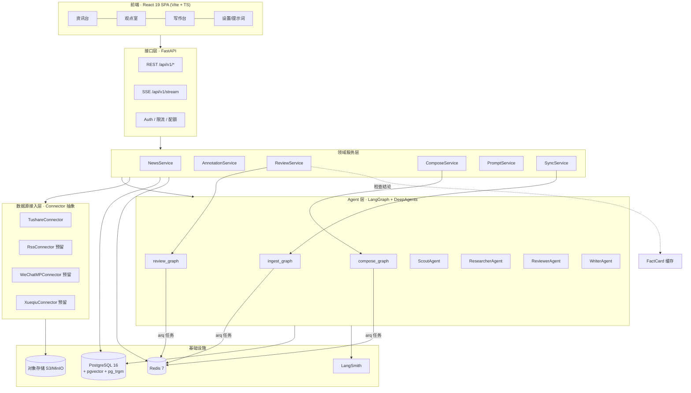
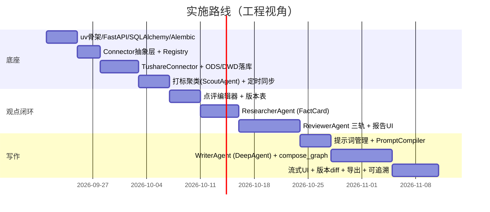

# 04 · 技术架构

## 1. 架构总览



---

## 2. 分层职责

| 层 | 职责 | 不做什么 |
| --- | --- | --- |
| **接口层** | 鉴权、参数校验（Pydantic）、限流、SSE 推送、错误码 | 不写业务逻辑，不直接调 LLM |
| **领域服务层** | 业务编排、事务边界、状态机流转、权限校验、DTO 转换 | 不感知 LangGraph 细节，只通过 `AgentRuntime` 门面调用 |
| **Agent 层** | 三张图 + 四个子 Agent，封装所有 LLM 决策 | 不直接访问 HTTP 请求上下文；所有 IO 走工具/repository |
| **数据源接入层** | 与外部数据源通信，产出统一 `NewsItem` | 不写业务库表关系，不感知用户 |
| **基础设施** | PG / Redis / S3 / 可观测 | — |

> **重要边界**：Agent 层通过 `Repository` 协议访问数据库，而不是直接持有 ORM session。
> 这样便于单测（注入内存实现）与未来把 Agent 拆成独立服务。

---

## 3. 技术选型与理由

| 类别 | 选型 | 为什么 | 备选与何时换 |
| --- | --- | --- | --- |
| 包管理 | **uv** | 单文件锁、速度极快、原生 workspace | — |
| 运行时 | **Python 3.12** | `asyncio` 成熟、类型标注完善 | — |
| Web | **FastAPI** | async 原生 + Pydantic 集成 + OpenAPI 自动生成 | Litestar（团队更偏好时） |
| Agent 编排 | **LangGraph 1.x** | 唯一能同时表达**循环 + 并行 + 中断/恢复 + 持久化状态**的成熟方案；HITL 是一等公民 | 自研状态机（不必要，成本更高） |
| Agent 封装 | **deepagents** | 直接给到 planning / subagent / 虚拟 FS / skills 四个能力，避免重复造轮子 | 手写 middleware（当 deepagents 不满足时局部替换） |
| **LLM 供应商** | 打标/聚类：**DeepSeek-V3 / Qwen-Plus**；检查/写作：**Claude Sonnet 4.x 或 GPT-4o 级**；embedding：**BGE-M3 / Qwen3-Embedding（1024 维）** | 中文财经场景 + 成本可控；强模型只在"检查 + 写作"两处用 | 私有化交付时换本地部署模型（Qwen 系列），走同一 `ModelProvider` 抽象 |
| 网页检索 | Tavily / 博查（国内） | **ResearcherAgent 必备**，tushare 覆盖不到海外与自由文本源 | 自建爬虫（量起来后） |
| 校验 | **Pydantic v2** | API schema 与 `with_structured_output` 复用同一套模型 | — |
| ORM | **SQLAlchemy 2.0 async** | 类型友好、支持 async、生态成熟 | SQLModel（会牺牲灵活性） |
| 迁移 | **Alembic** | 与 SQLAlchemy 同源；配 naming_convention 避免 autogenerate 噪声 | — |
| 主库 | **PostgreSQL 16** | 关系 + `vector` + `pg_trgm` + `jsonb` + 分区，一个库覆盖 90% 需求 | 向量量级 > 5000 万时拆出专用向量库 |
| 缓存/队列 | **Redis 7 + arq** | arq 是 asyncio 原生，与 FastAPI/LangGraph 同栈；比 Celery 轻 | 需要复杂路由/重试策略时换 Celery |
| 对象存储 | **S3 兼容** | 公告 PDF、导出稿、封面图 | — |
| 可观测 | **LangSmith + structlog** | LangGraph 原生溯源；业务日志与 trace 用 `run_id` 串联 | 私有化场景换 Langfuse（可自托管） |
| 前端 | **React 19 + Vite + TS** | 见 §8 | Next.js（需要 SSR/一体化时） |

### 3.1 为什么不直接用 LangChain Chain / 裸 OpenAI SDK

- **裸 SDK**：要实现并行检查、中断恢复、状态持久化，等于自己写一遍 LangGraph。
- **LCEL Chain**：线性管道无法表达"检查不通过 → 回到编辑 → 重新检查"的循环，也无法表达 HITL 断点。
- **LangGraph 的独有收益**：
  1. `interrupt()` + `Command(resume=)` → 大纲确认断点（本产品核心体验）
  2. Postgres checkpointer → 服务重启不丢进度（长文写作任务典型需要 60~120s）
  3. `Send` API → map-reduce 并行检查 N 条点评
  4. `astream_events` → 直接驱动前端 SSE 与"Agent 正在做什么"的可视化

---

## 4. 数据源接入层（抽象设计，本方案的关键工程点）

> **需求**：今天只用 tushare，明天要接 RSS / 公众号 / 雪球 / 交易所公告 / 板块行情，
> 且这些源的数据形态差异极大（结构化行情 vs 长篇文本 vs PDF 公告）。
> 因此抽象要覆盖两类：**资讯类（content）** 与 **市场数据类（market）**。

### 4.1 分层：ODS → DWD → 应用

```
外部源
  ↓ Connector.fetch()          # 只负责"拿到原始数据"
raw_documents (ODS)            # 原始 payload 全量留档，jsonb，永不丢弃
  ↓ Normalizer.normalize()     # 转成统一 NewsItem
news_items (DWD)               # 归一化、去重、打标、向量化，供业务查询
  ↓
应用层（资讯流 / 检查 / 写作）
```

**为什么保留 ODS？** 因为归一化规则会变（今天没抽出的字段明天想用）。
原始层留档 = 可以随时"重放"归一化，而不用重新调外部接口（省积分、抗断供）。

### 4.2 核心协议

```python
# app/connectors/base.py
from abc import ABC, abstractmethod
from collections.abc import AsyncIterator
from datetime import datetime
from typing import Any, Literal

from pydantic import BaseModel, Field


class ConnectorCapability(BaseModel):
    """连接器能力声明——调度器据此决定同步策略与 UI 展示。"""
    content_types: list[str]                 # {"flash","article","announcement","policy","research_report"}
    supports_incremental: bool = True
    supports_backfill: bool = True
    rate_limit_per_min: int | None = None    # tushare 积分限流
    requires_credentials: bool = False


class RawItem(BaseModel):
    """原始条目：不做语义加工，只做必要的定位与幂等标识。"""
    external_id: str                         # 源内唯一 id（没有则用内容 hash）
    payload: dict[str, Any]                  # 原始结构原样保留
    fetched_at: datetime
    source_ref: str | None = None            # 原文 url / 文件 key


class NewsDraft(BaseModel):
    """归一化中间态：Connector 尽力填，缺失由 Enricher 补。"""
    external_id: str
    content_type: Literal["flash", "article", "announcement", "policy",
                          "research_report", "interactive_qa", "social_post", "market_data"]
    title: str
    summary: str | None = None
    content: str | None = None
    author: str | None = None
    url: str | None = None
    published_at: datetime
    lang: str = "zh"
    symbols: list[str] = Field(default_factory=list)      # 标准码 600519.SH
    industries: list[str] = Field(default_factory=list)
    entities: list[dict[str, Any]] = Field(default_factory=list)
    market_scope: list[str] = Field(default_factory=list)  # {"a_share","hk","us","macro"}
    extra: dict[str, Any] = Field(default_factory=dict)


class SyncCursor(BaseModel):
    """增量游标：每个连接器独立持久化，支持断点续拉。"""
    last_external_id: str | None = None
    last_published_at: datetime | None = None
    payload: dict[str, Any] = Field(default_factory=dict)


class DataSourceConnector(ABC):
    """所有数据源必须实现的契约。"""

    key: str                                  # 唯一标识，如 "tushare.news"
    display_name: str
    capability: ConnectorCapability

    def __init__(self, config: dict[str, Any]) -> None:
        self.config = config

    @abstractmethod
    async def validate(self) -> tuple[bool, str]:
        """凭据/权限/连通性自检。返回 (是否可用, 人话说明)。"""

    @abstractmethod
    def fetch(self, cursor: SyncCursor, window: tuple[datetime, datetime]) -> AsyncIterator[RawItem]:
        """拉取原始数据流。必须支持分段，避免长区间一次性拉取。"""

    @abstractmethod
    def normalize(self, raw: RawItem) -> NewsDraft:
        """原始 → 归一化。必须是纯函数，便于回放与单测。"""

    async def close(self) -> None:  # 可选钩子
        return None
```

### 4.3 注册表（插件式）

```python
# app/connectors/registry.py
from typing import TypeAlias
from app.connectors.base import DataSourceConnector

_REGISTRY: dict[str, type[DataSourceConnector]] = {}

def register(cls: type[DataSourceConnector]) -> type[DataSourceConnector]:
    if cls.key in _REGISTRY:
        raise ValueError(f"duplicate connector key: {cls.key}")
    _REGISTRY[cls.key] = cls
    return cls

def get_connector_class(key: str) -> type[DataSourceConnector]:
    try:
        return _REGISTRY[key]
    except KeyError as exc:
        raise LookupError(f"未注册的数据源: {key}") from exc

def available_connectors() -> list[dict]:
    return [
        {"key": c.key, "name": c.display_name, "capability": c.capability.model_dump()}
        for c in _REGISTRY.values()
    ]
```

> 新增数据源 = 新增一个文件 + `@register` 装饰器，**不需要改调度器、不需要改 API、不需要改前端**
> （前端从 `GET /connectors/available` 动态渲染）。

### 4.4 TushareConnector 实现要点

基于 tushare 的资讯类接口（详见 `tushare-data` skill 的接口清单）：

| 接口 | 产出 content_type | 说明 |
| --- | --- | --- |
| `news` | `flash` | 主流财经网站快讯，6 年+ 历史，支持 `src` 参数按来源过滤 |
| `major_news` | `article` | 长篇通讯，8 年+ 历史 |
| `cctv_news` | `article` | 新闻联播文字稿（2017 起），适合宏观叙事素材 |
| `anns_d` | `announcement` | 全量公告，带 PDF url → 下载入对象存储 |
| `npr` | `policy` | 国家政策库：法规/条例/批复/通知原文 |
| `research_report` | `research_report` | 研报，用于观点参照与行业数据 |
| `irm_qa_sh` / `irm_qa_sz` | `interactive_qa` | 互动易问答，公司口径的原始表述 |

```python
# app/connectors/tushare/connector.py（骨架）
@register
class TushareNewsConnector(DataSourceConnector):
    key = "tushare.news"
    display_name = "Tushare 财经资讯"
    capability = ConnectorCapability(
        content_types=["flash", "article", "announcement", "policy", "research_report"],
        rate_limit_per_min=...,
        requires_credentials=True,
    )

    ENDPOINTS = [
        # (接口名, 拉取粒度, content_type, 时间字段)
        ("news",          "hour", "flash"),
        ("major_news",    "day",  "article"),
        ("anns_d",        "day",  "announcement"),
        ("npr",           "day",  "policy"),
        ("research_report", "day", "research_report"),
    ]

    async def validate(self) -> tuple[bool, str]:
        # 1) token 是否存在；2) 轻量接口冒烟（trade_cal）
        # 3) 对高积分接口提前探测并给出"人话"提示，而不是等主查询失败
        ...

    async def fetch(self, cursor, window) -> AsyncIterator[RawItem]:
        # 关键点：
        #  - 按 ENDPOINTS 的粒度切分时间段（小时/天），避免一次拉长区间
        #  - token bucket 限流，撞 429 指数退避重试（仅瞬时错误重试）
        #  - 每完成一段 yield 一次，落库后可更新 cursor → 断点续拉
        ...

    def normalize(self, raw: RawItem) -> NewsDraft:
        # 字段映射 + 时间标准化(YYYYMMDD→tz-aware) + 代码补全(000001→000001.SZ)
        # 纯函数，无 IO；缺失字段留给 Enricher
        ...
```

### 4.5 同步调度

```python
# app/services/sync_service.py（骨架）
async def run_sync(connector_id: UUID) -> None:
    run = await sync_repo.start_run(connector_id)          # sync_runs: running
    success = failed = duplicated = 0
    try:
        async with connector_factory(connector_id) as conn:
            async for raw in conn.fetch(cursor, window):
                row_id = await raw_repo.upsert(raw)         # ODS，幂等（canonical JSON hash）
                draft = conn.normalize(raw)
                # ★ 返回 (news_id, is_new)：命中 content_hash 时 is_new=False，
                #   但绝不能丢弃 —— 必须追加 source_refs + duplicate 关联 + 簇 source_count，
                #   否则"多源交叉验证"退化为单源（见 05-database-schema.md §4.9）
                news_id, is_new = await news_repo.upsert_draft(draft, row_id)
                if is_new:
                    await enrich_queue.enqueue(news_id)      # 异步打标/向量化
                    await fact_queue.enqueue(news_id)        # ★ 异步预生成资讯级事实基线
                    success += 1
                else:
                    await news_repo.link_duplicate(news_id, row_id)   # 跨源登记来源
                    duplicated += 1
                await sync_repo.touch_cursor(connector_id, raw)  # 每段更新，支持续拉
    except Exception as exc:
        await sync_repo.fail_run(run.id, exc)
        log.exception("sync failed", connector_id=connector_id)
        raise
    finally:
        await sync_repo.finish_run(run.id, success, failed, duplicated=duplicated)
        await interest_service.recall_for_users(since=...)     # 兴趣召回
```

**错峰与限流**：同一 connector 不允许并发运行（Redis 分布式锁）；
全局并发上限由配置控制；非交易日自动降频。

---

## 5. Agent 编排设计

### 5.1 三张图

| 图 | 触发 | 关键特性 |
| --- | --- | --- |
| `ingest_graph` | 同步任务 / 手动重放 | 打标、实体抽取、聚类、重要度打分；批处理，无 HITL |
| `review_graph` | 用户提交检查 | **`Send` API 并行 map-reduce**；每条点评三轨并行 |
| `compose_graph` | 用户触发写作 | **`interrupt()` HITL 断点**；DeepAgent 嵌套；流式输出 |

### 5.2 `review_graph` 骨架

```python
# app/agents/review/graph.py
from langgraph.graph import StateGraph, START, END
from langgraph.types import Send, interrupt, Command
from typing import Annotated, TypedDict
import operator


class ReviewState(TypedDict):
    project_id: str
    annotation_ids: list[str]
    annotation_versions: dict[str, str]         # annotation_id -> version_id
    fact_cards: Annotated[dict[str, dict], operator.or_]
    findings: Annotated[list[dict], operator.add]
    report_ids: list[str]
    summary: str


def fan_out_annotations(state: ReviewState):
    """map：为每条点评派生一个子任务（并行）。"""
    return [Send("review_one", {**state, "current_annotation_id": aid})
            for aid in state["annotation_ids"]]


async def review_one(state: dict):
    """单条点评的三轨检查并行执行。

    ★ FactCard 不再在 review 时同步生成：资讯级事实基线由 ingest 阶段异步预生成，
      这里直接读缓存（未命中才降级为实时检索并打标 trigger_source='on_demand'）。
      这是"检查单条 < 8s"能达成的前提，也是最大的一项成本优化。
    """
    aid = state["current_annotation_id"]
    version = state["annotation_versions"][aid]
    news_id = state["news_item_of"][aid]

    fact_card = await fact_card_repo.get_by_news(news_id)          # 缓存优先
    if fact_card is None:
        fact_card = await research_agent.arun(news_item_id=news_id, trigger="on_demand")

    async with asyncio.TaskGroup() as tg:
        t_fact = tg.create_task(review_agent.fact_track(version, fact_card))
        t_logic = tg.create_task(review_agent.logic_track(version, fact_card))
        t_comp = tg.create_task(review_agent.compliance_track(version))
    findings = t_fact.result() + t_logic.result() + t_comp.result()

    return {"findings": findings, "fact_cards": {aid: fact_card.model_dump()}}


async def reduce_and_persist(state: ReviewState):
    report = aggregate(state)                     # severity 排序 + verdict 判定
    await report_repo.save_many(report)           # review_reports + review_findings
    return {"report_ids": report.ids, "summary": report.summary}


builder = StateGraph(ReviewState)
builder.add_node("prepare", prepare_context)
builder.add_conditional_edges("prepare", fan_out_annotations, ["review_one"])
builder.add_node("review_one", review_one)
builder.add_edge("review_one", "reduce_and_persist")
builder.add_node("reduce_and_persist", reduce_and_persist)
builder.add_edge("reduce_and_persist", END)

review_graph = builder.compile(
    checkpointer=postgres_checkpointer,           # 可恢复、可重放
    store=postgres_store,                         # 跨 run 的长期记忆（观点库/风格）
)
```

**结构化输出**用 Pydantic + `with_structured_output`，避免解析自由文本：

```python
class FindingList(BaseModel):
    findings: list[Finding]

structured = model.with_structured_output(FindingList)
```

### 5.3 `compose_graph` 骨架（WriterAgent = DeepAgent）

```python
# app/agents/compose/graph.py
class ComposeState(TypedDict):
    project_id: str
    brief: str
    fact_cards: list[dict]
    prompt_bundle: dict                      # 从 PromptService 编译出的技能包
    outline: str | None
    sections: Annotated[dict[str, str], operator.or_]
    final_md: str | None
    citation_map: dict[str, list[str]]
    todos: list[str]
    # ★ 用户在写作中途注入的指令（"第二段压缩一半"）。DeepAgent 每次 ainvoke 是无状态的，
    #   必须把累积的 messages 显式传进去，否则中途指令根本进不了子 agent。
    messages: Annotated[list[dict], operator.add]


async def build_brief(state):  # 装载素材 → 虚拟文件系统
    fs = StateBackend(state)
    fs.write("/brief.md", render_brief(state))
    for fc in state["fact_cards"]:
        fs.write(f"/facts/{fc['news_item_id']}.md", render_fact_card(fc))
    fs.write("/style-guide.md", state["prompt_bundle"]["style"])
    fs.write("/forbidden.md", state["prompt_bundle"].get("forbidden", ""))
    return {"brief": fs.read("/brief.md")}


async def plan_and_outline(state):
    agent = build_writer_agent(            # ← deepagents: create_deep_agent
        model=strong_model,
        tools=[...],
        system_prompt=writer_system_prompt(state["prompt_bundle"]),
        subagents=[outline_agent, section_agent, fact_check_agent, style_agent, title_agent],
        backend=StateBackend(state),       # 虚拟 FS
        skills=[state["prompt_bundle"]["skill"]],   # 用户提示词 → Skill
    )
    result = await agent.ainvoke({"messages": [{"role": "user", "content": OUTLINE_TASK}]})
    return {"outline": extract_outline(result)}


async def hitl_outline(state):
    """HITL 断点：等待用户确认大纲。"""
    decision = interrupt({
        "type": "outline_approval",
        "outline_md": state["outline"],
        "options": ["approve", "edit", "regenerate"],
    })
    if decision["action"] == "approve":
        return {"outline": state["outline"]}
    if decision["action"] == "edit":
        return {"outline": decision["outline_md"]}
    return {"outline": state["outline"]}    # regenerate → 路由回 plan_and_outline


async def write_sections(state):
    """分段并行写作 → 事实复核 → 风格统一（DeepAgent 内部通过 subagent 完成）。

    ★ 必须把 state["messages"]（用户中途指令）显式塞进 ainvoke 的输入，
      否则 `update_state` 注入的指令进不了 DeepAgent 内部。
    """
    agent = build_writer_agent(...)
    result = await agent.ainvoke({
        "messages": [
            {"role": "user", "content": SECTION_TASK},
            *state.get("messages", []),          # ← 中途指令累积
        ]
    })
    return {"sections": extract_sections(result)}


builder = StateGraph(ComposeState)
builder.add_node("build_brief", build_brief)
builder.add_node("plan_and_outline", plan_and_outline)
builder.add_node("hitl_outline", hitl_outline)
builder.add_node("write_sections", write_sections)
builder.add_node("persist", persist_article)
builder.add_edge(START, "build_brief")
builder.add_edge("build_brief", "plan_and_outline")
builder.add_edge("plan_and_outline", "hitl_outline")
builder.add_conditional_edges("hitl_outline", route_after_approval, {
    "write": "write_sections", "replan": "plan_and_outline", "edit": "plan_and_outline",
})
builder.add_edge("write_sections", "persist")
builder.add_edge("persist", END)

compose_graph = builder.compile(checkpointer=postgres_checkpointer, store=postgres_store)
```

**恢复与续跑**：

```python
# 用户确认大纲
await compose_graph.aupdate_state(config, Command(resume={"action": "approve"}))
# 写作中途发指令
await compose_graph.aupdate_state(config, {"messages": [{"role": "user", "content": "第二段压缩一半"}]})
```

### 5.4 arq worker 与 HITL 长任务的生命周期（重要修订）

**问题**：`compose_graph` 在 `hitl_outline` 节点 `interrupt()` 后进入 `waiting_human`。
如果这个 arq job 一直挂着等待用户确认，20 个并发用户就能耗尽全部 worker 槽位；
且 arq 的 job timeout 会把等待中的任务判为超时。

**规则**：**interrupt = job 结束，resume = 新 job**。

| 阶段 | 动作 |
| --- | --- |
| 触发写作 | `POST /projects/{id}/compose` → enqueue `compose_job` → `202 {run_id}` |
| 跑到 `interrupt` | job **正常结束**；落 `agent_runs.status='waiting_human'` + `interrupt_payload`；推 SSE `compose.outline_ready` |
| 用户确认 | `POST /runs/{id}/resume` → enqueue **新 job** `compose_resume_job` → 调 `Command(resume=...)` 续跑 |
| 服务重启 | Postgres checkpointer 恢复；`waiting_human` 的 run 由启动时的扫描任务重新入队 |

```python
# app/workers/settings.py
class WorkerSettings:
    max_jobs = 8                       # 低并发高耗时：LLM 调用是 IO 密集，但单 job 占用久
    job_timeout = 900                  # 15min，单次"无中断连续执行"的上限
    max_tries = 2                      # LLM 任务不做自动重试（成本 + 非幂等），失败交用户决定
    poll_delay = 0.5
    health_check_interval = 30
    # 关键：compose_job 必须在 interrupt 时 return，而不是 await 用户输入
```

**僵尸 run 清理**：定时任务扫描 `status='waiting_human' AND updated_at < now() - interval '24 hours'`
→ 置 `cancelled` 并通知用户。否则中断的 run 会永久堆积。

### 5.5 两个 `store` 的用途（长期记忆）

| 存储 | 内容 | 用途 |
| --- | --- | --- |
| `checkpointer` | 单次 run 的完整状态 | 断点续跑、失败恢复 |
| `store` | 跨 run 的长期记忆 | 观点库（历史观点向量）、风格画像、用户偏好、finding 驳回历史 |

> `store` 是 M4 "越用越懂你" 的技术基础：`uniqueness` 轨道查历史观点，
> `WriterAgent` 从 store 取 few-shot 用户历史成稿，风格克隆效果随时间变好。

---

## 6. 提示词体系：从「文本框」到「技能包」

> 用户说"用户可以单独配置自己的提示词管理"。**不要只做一个 CRUD 文本框列表**，
> 那会让用户产出质量参差、也无法被 Agent 有效使用。设计成**可编译的技能包**。

### 6.1 提示词分类（`prompt_kind`）

| 类型 | 作用 | 示例 |
| --- | --- | --- |
| `persona` | 人格设定 | "我是 10 年买方研究员，说话直接，喜欢用反问" |
| `style` | 文风与句式 | "短句为主，每段不超 4 行，少用形容词，数据必须带口径" |
| `structure` | 文章结构模板 | "开头钩子 → 事实复述 → 我的判断 → 反面情形 → 结论" |
| `forbidden` | 禁忌清单 | "禁用'赋能/闭环/抓手'；不写收益预测；不提具体仓位" |
| `research` | 事实检索偏好 | "优先看年报原文，其次看券商研报，自媒体仅作线索" |
| `custom` | 自由文本 | 用户自定义任何补充要求 |

### 6.2 编译流程

```
用户编辑提示词（Markdown + 变量 {{market}} {{target_reader}}）
    → 保存为 prompt_template + prompt_template_version（不可变快照）
    → 选题写作时选择一组模板 → PromptCompiler 编译
         ├─ 拼成 system_prompt 段落
         ├─ 生成 Skill 包（SKILL.md + 约束清单 + few-shot 示例）
         └─ 变量注入校验（缺失变量 → 提交前拦截）
    → 注入 WriterAgent
```

**Why Skill 而不是塞进 prompt**：`deepagents` 的 skills 是**渐进式加载**的 ——
只有相关时才加载全文，能显著降低长文写作时的上下文占用，
且用户可以在不重启服务的情况下更新自己的风格包。

### 6.3 官方模板库

提供 6~8 套开箱即用的模板（"雪球短评体"、"公众号深度复盘"、"政策解读"、
"财报拆解"、"行业周报"、"快讯点评"），新用户直接选，降低冷启动成本。

---

## 7. API 设计

### 7.1 约定

- 前缀 `/api/v1`，JWT 鉴权，`X-Request-Id` 贯穿日志与 trace
- 分页：`?cursor=&limit=`（游标式，适配时间流）
- 错误：`{"code": "REVIEW_BLOCKED", "message": "...", "details": {...}}`
- 长任务：返回 `202 + {run_id}`，进度走 SSE

### 7.2 核心端点

| 方法 | 路径 | 说明 |
| --- | --- | --- |
| **数据源** | | |
| `GET` | `/connectors/available` | 可用连接器 + 能力声明（动态渲染配置表单） |
| `GET` `POST` `PATCH` `DELETE` | `/connectors` | 连接器实例 CRUD |
| `POST` | `/connectors/{id}/validate` | 凭据与权限自检 |
| `POST` | `/connectors/{id}/sync` | 手动触发同步（可指定时间窗回填） |
| `GET` | `/connectors/{id}/runs` | 同步历史与统计 |
| **资讯** | | |
| `GET` | `/news` | 资讯流（筛选：时间/类型/市场/行业/来源/重要度/已读） |
| `GET` | `/news/{id}` | 详情（含聚类内其他来源、关联标的、相关历史） |
| `GET` | `/news/clusters/{id}` | 事件簇展开 |
| `POST` | `/news/{id}/actions` | 收藏/隐藏/评级/已读 |
| `GET` | `/news/inbox` | 兴趣召回的个人化收件箱 |
| `POST` | `/news/search` | 语义 + 关键词混合检索 |
| **点评** | | |
| `POST` | `/annotations` | 创建点评（批量，`items[]`） |
| `GET` | `/annotations` | 列表（按项目/资讯/状态过滤） |
| `PATCH` | `/annotations/{id}` | 更新（生成新版本） |
| `GET` | `/annotations/{id}/versions` | 版本历史 |
| `POST` | `/annotations/{id}/restore` | 回退到某版本 |
| **检查** | | |
| `POST` | `/reviews` | 提交检查（批量）→ `202 {run_id}` |
| `GET` | `/reviews/{id}` | 报告详情 |
| `GET` | `/reviews/by-project/{pid}` | 项目级汇总 |
| `PATCH` | `/reviews/findings/{fid}` | 采纳 / 驳回（带理由）/ 标记已确认 |
| `POST` | `/reviews/{id}/recheck` | 增量复检 |
| `GET` | `/fact-cards/{news_item_id}` | 事实卡片 |
| **提示词** | | |
| `GET` `POST` | `/prompt-templates` | 列表（含官方库）/ 创建 |
| `PATCH` `DELETE` | `/prompt-templates/{id}` | 更新 / 删除 |
| `GET` | `/prompt-templates/{id}/versions` | 版本历史 |
| `POST` | `/prompt-templates/{id}/test` | 用样例文本试写一段，预览效果 |
| **选题与写作** | | |
| `POST` | `/projects` | 创建选题 |
| `GET` `PATCH` | `/projects/{id}` | 详情 / 更新（素材、提示词、要求） |
| `POST` | `/projects/{id}/compose` | 触发写作 → `202 {run_id}` |
| `POST` | `/runs/{run_id}/resume` | HITL 恢复（大纲确认 / 中途指令） |
| `POST` | `/runs/{run_id}/cancel` | 取消 |
| `GET` | `/runs/{run_id}` | 状态、步骤、token 消耗、trace 链接 |
| **稿件** | | |
| `GET` `PATCH` | `/articles/{id}` | 详情 / 人工编辑（生成新版本） |
| `GET` | `/articles/{id}/versions` | 版本列表 |
| `GET` | `/articles/{id}/diff` | 两版本 diff |
| `POST` | `/articles/{id}/regenerate-section` | 段落重写 |
| `GET` | `/articles/{id}/traceability` | 段落 → 点评 → 资讯 → 证据链路 |
| `POST` | `/articles/{id}/export` | 导出 MD / HTML / DOCX |
| **实时** | | |
| `GET` | `/stream/runs/{run_id}` | SSE 事件流 |
| **系统** | | |
| `GET` | `/me/usage` | 用量与配额 |
| `GET` | `/me/interests` `PUT` | 兴趣画像 |

---

## 8. 前端方案

### 8.1 决策：React SPA，不用 Astro 做主体

| 维度 | Astro | React SPA (Vite) | 结论 |
| --- | --- | --- | --- |
| 页面性质 | 内容/静态优先 | **登录后强交互后台** | React |
| SEO | 强 | 无（不需要） | React 不吃亏 |
| 交互复杂度 | 岛屿间状态共享麻烦 | 天然全局状态 | React |
| 实时流（SSE 流式写作） | 需要 client component 包裹 | 直接处理 | React |
| 富文本编辑器 | 需 client:only | 直接 | React |
| 构建/心智 | 多一层 island 规则 | 简单 | React |
| 首屏 | 更快 | 需 code split | 差异不大（后台应用可接受） |
| 局限 | — | 落地页/文档站不擅长 | 用 Astro 单独做 marketing site |

**最终**：主应用 **React 19 + Vite + TypeScript**；未来若需要官网/文档/公开内容站，再单独建一个 Astro 项目（`apps/site`），不混在主应用里。

### 8.2 前端技术栈

| 类别 | 选型 | 用途 |
| --- | --- | --- |
| 框架 | React 19 + Vite 6 + TS 5.x | SPA |
| 路由 | TanStack Router | 类型安全路由 |
| 数据 | TanStack Query v5 | 服务端状态、缓存、乐观更新 |
| 客户端状态 | Zustand | 选中态、编辑器草稿、UI 偏好 |
| 样式 | Tailwind CSS v4 | 原子化 |
| 组件 | shadcn/ui + Radix | 可复制可改的无样式组件 |
| 表单 | react-hook-form + zod | 校验与复用后端 schema 思路 |
| 富文本 | **Tiptap** | 点评编辑器 + 文章编辑器 |
| 虚拟列表 | TanStack Virtual | 资讯流万级条目流畅滚动 |
| 图表 | ECharts | 行情小图、用量看板 |
| 流式 | 原生 `EventSource`（+ fetch SSE 兜底） | 写作与检查进度 |
| diff | `diff-match-patch` / `react-diff-viewer` | 版本对比 |
| 测试 | Vitest + Playwright | 单测 + E2E |

### 8.3 页面结构

```
/                        今日收件箱（兴趣召回 + 重要资讯）
/news                    资讯流（筛选 + 批量选择）
/news/:id                资讯详情（抽屉或整页）
/inbox/review            观点室：批量点评工作台（左写 / 右原文）
/inbox/review/:id        单条点评 + 体检报告
/projects                选题列表
/projects/:id            选题详情（素材 / 提示词 / 写作要求）
/projects/:id/compose    写作台（大纲 → 流式成稿 → 编辑 → 导出）
/articles                稿件库
/articles/:id            稿件详情（编辑 / 版本 / 可追溯）
/settings/connectors     数据源管理
/settings/interests      兴趣画像
/settings/prompts        提示词管理
/settings/style          风格画像（从历史文章提取）
/usage                   用量与成本
```

### 8.4 前端工程要点

- **SSE 断线重连**：带 `Last-Event-ID`，服务端补发丢失事件
- **乐观更新**：评级/收藏即时反馈，失败回滚 + Toast
- **草稿本地兜底**：点评内容同时写 `localStorage`，网络异常不丢字
- **键盘优先**：资讯流与点评工作台全键盘可操作（重度用户效率）
- **长列表性能**：虚拟滚动 + 分页游标
- **错误边界**：Agent 任务失败要显示"哪一步失败 + 可重试"，不要白屏

---

## 9. 目录结构

```
news-director-agent/
├── apps/
│   ├── api/                          # FastAPI 后端
│   │   ├── app/
│   │   │   ├── main.py
│   │   │   ├── core/                 # 配置、日志、安全、依赖注入
│   │   │   ├── api/v1/               # 路由（thin controllers）
│   │   │   ├── domain/               # 领域模型（纯 Pydantic / dataclass）
│   │   │   ├── services/             # 领域服务（事务边界）
│   │   │   ├── repositories/         # 数据访问（Protocol + SQLAlchemy 实现）
│   │   │   ├── connectors/           # ★ 数据源接入层
│   │   │   │   ├── base.py           #   Protocol / RawItem / NewsDraft
│   │   │   │   ├── registry.py       #   插件注册
│   │   │   │   └── tushare/          #   TushareConnector
│   │   │   ├── agents/               # ★ Agent 层
│   │   │   │   ├── runtime.py        #   AgentRuntime 门面
│   │   │   │   ├── ingest/           #   ScoutAgent + ingest_graph
│   │   │   │   ├── research/         #   ResearcherAgent + 4 个子代理
│   │   │   │   ├── review/           #   ReviewerAgent 三轨 + review_graph
│   │   │   │   ├── compose/          #   WriterAgent + compose_graph
│   │   │   │   ├── prompts/          #   系统提示词模板
│   │   │   │   └── skills/           #   Skill 定义与编译
│   │   │   ├── models/               # SQLAlchemy 模型
│   │   │   ├── schemas/              # API Pydantic schema
│   │   │   ├── workers/              # arq 任务（sync / review / compose / enrich）
│   │   │   └── lib/                  # 去重、向量、文本、限流工具
│   │   ├── alembic/
│   │   │   └── versions/
│   │   ├── tests/
│   │   ├── pyproject.toml
│   │   └── .env.example
│   └── web/                          # React SPA
│       ├── src/{routes,components,hooks,lib,stores,api}
│       ├── package.json
│       └── vite.config.ts
├── packages/
│   └── shared/                       # 可选：共享类型/常量（前后端对齐）
├── docs/                             # 本方案文档
├── infra/
│   ├── docker-compose.yml            # pg + redis + minio + api + worker + web
│   └── initdb/                       # 扩展初始化、种子数据
└── README.md
```

> 用 uv workspace 管理 `apps/api`（Python），pnpm workspace 管理 `apps/web`（Node）。

---

## 10. 部署、可观测、非功能

### 10.1 本地与生产

```yaml
# infra/docker-compose.yml（要点）
services:
  postgres:   # postgres:16 + pgvector 扩展，挂载 initdb 创建 vector/pg_trgm/pgcrypto
  redis:      # redis:7-alpine
  minio:      # 对象存储
  api:        # uvicorn app.main:app --host 0.0.0.0 --port 8000
  worker:     # arq app.workers.settings.WorkerSettings
  web:        # pnpm build && nginx 托管 dist
```

生产演进：API 与 worker 独立扩缩容；PG 用托管版（读副本给检索）；
Redis 用托管版；对象存储用云 OSS。**Agent 层可单独拆成服务**（因为已通过 Repository 协议解耦）。

#### 10.1.1 私有化交付路径（券商/基金 P0 客户的硬要求）

`02-audience.md` 把「券商/基金分析师」列为 P0，而这类客户要求**私有化部署 / 数据不出域 / 审计留痕**。
v1 的 SaaS 架构必须能闭网运行，因此以下组件**必须可替换**，从第一行代码起就走抽象：

| 组件 | SaaS | 私有化 | 抽象方式 |
| --- | --- | --- | --- |
| LLM | Claude / GPT / DeepSeek API | 本地 vLLM / Ollama 部署 Qwen 系列 | `ModelProvider` 协议（**必做**，否则 M3 后改造是灾难） |
| Embedding | 云端 API | 本地 BGE-M3 | 同上 |
| 可观测 | LangSmith | **Langfuse 自托管** | `Tracer` 协议；`agent_runs.trace_url` 存各自链接 |
| 对象存储 | 云 OSS | MinIO（已在 compose 中） | S3 兼容接口，天然一致 |
| 凭据加密 | KMS | 本地 Fernet（密钥由部署方注入） | `SecretsProvider` 协议 |
| 外部检索 | Tavily / 博查 | 关闭，仅用已入库资讯 | capability 开关 |

> 约束：`compliance_rules` / `audit_logs` 在**两种部署下行为必须一致**——这是企业版的核心卖点，
> 不能做成"SaaS 版才有"。

### 10.2 可观测

| 维度 | 方案 |
| --- | --- |
| LLM trace | LangSmith（每次 run 记录 `run_id`，业务表存链接） |
| 结构化日志 | structlog，字段含 `request_id / run_id / connector_id / user_id` |
| 指标 | Prometheus：同步条数/耗时、检查延迟、写作时长、token 消耗、失败率 |
| 成本 | 按 run 累计 token 与费用，写入 `usage_records`，UI 出看板 |
| 告警 | 同步连续失败、blocker 率突增、单 run 费用超阈值 |

### 10.3 关键非功能

| 项 | 设计 |
| --- | --- |
| **幂等** | ODS 用 `unique(connector_id, external_id)`；DWD 用 `content_hash` 唯一索引 + upsert |
| **并发** | 同 connector 串行（分布式锁）；检查/写作任务并行受队列并发上限控制（arq `max_jobs`，见 §5.4）；**单批检查并发上限 5 条**（20 条排队而非同时打满 LLM） |
| **限流** | connector 内 token bucket；API 侧按用户配额；LLM 调用失败退避 + 熔断 |
| **缓存** | ★ 事实卡片按 **`news_item_id`** 缓存（资讯级基线，与点评无关，见 §5.2 修订）；embedding 按 `content_hash` 缓存；热点资讯详情 Redis 缓存 |
| **成本控制** | `usage_records` 按 run 实时累计；**硬配额上限**（超额直接拒绝而非提示），见 `01-product-plan.md` §6；单 run 费用超阈值即中断并告警 |
| **安全** | 连接器凭据加密存储（Fernet / KMS）；RLS 或应用层强制 `user_id` 过滤；审计日志 |
| **合规** | 系统级 prompt 硬约束 + `compliance` 轨道 + 红线词库 + 导出时 AI 标识 + `audit_logs` 留痕 |
| **数据保留** | ODS 原始层按需归档（对象存储冷存）；`news_items` 按月分区（量大后） |

---

## 11. 实施顺序（工程视角）



### 技术风险前置验证（Spike，各 1~2 天）

1. **tushare 资讯接口权限与数据质量真机验证** —— 先跑 `news` / `major_news` / `anns_d`，确认字段、时间范围、限流阈值。
2. **LangGraph interrupt + Postgres checkpointer 端到端验证** —— HITL 是核心体验，必须最先验证。
   **且必须验证"interrupt 后 arq job 结束、resume 起新 job"这条路径**（见 §5.4）。
3. **deepagents 虚拟文件系统在后端（非内存）下的持久化验证** —— 决定长文写作能否断点续跑。
4. **中文向量模型选型** —— 如 BGE-M3 / Qwen3-Embedding，确认维度与检索效果（**定完再写死 `vector(N)`**，换维度要重建 HNSW）。
5. **结构化输出稳定性压测** —— `with_structured_output` 在长文本上的失败率与重试策略。
6. **★ deepagents `skills` 参数形态验证** —— `skills` 实际接收的是**目录路径**（`SKILL.md` 所在目录）而非字符串/对象，
   与 §5.3 伪代码里的 `skills=[state["prompt_bundle"]["skill"]]` 可能不匹配。
   需确认：用户动态编译的提示词包能否走 `StateBackend` 虚拟路径，或必须落盘到临时目录。**这个不确定会直接阻塞 M3。**
7. **★ 单篇成本真机测量** —— 跑一次完整 compose（brief + outline + 5 段 + 复核 + 风格），
   实测 token 与耗时，回填定价模型。这是唯一可能推翻商业模型的数据。
