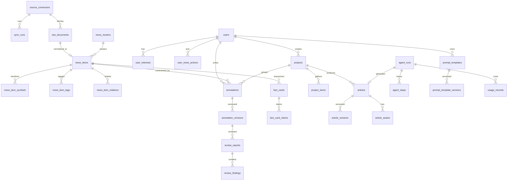

# 05 · 数据库表结构

> 主库：**PostgreSQL 16**（扩展：`pgcrypto` / `vector` / `pg_trgm`）
> ORM：SQLAlchemy 2.0 async · 迁移：Alembic

---

## 1. 设计约定

| 约定 | 说明 |
| --- | --- |
| 主键 | 统一 `uuid DEFAULT gen_random_uuid()`（`pgcrypto`），避免自增 ID 泄漏业务量与并发写热点 |
| 时间 | 统一 `timestamptz`，服务端一律 UTC，展示层转本地 |
| 软删除 | 业务表用 `deleted_at timestamptz NULL`，查询默认过滤 |
| 审计字段 | `created_at` / `updated_at`（`updated_at` 由触发器维护） |
| 枚举 | 用 PG `ENUM` 类型（可读性好、Alembic 可管理）；高频变更的分类用字典表 |
| 分层 | `ODS`（原始留档）→ `DWD`（归一化）→ 应用层，见 `04-architecture.md` §4.1 |
| 分区 | `raw_documents` / `news_items` 数据量最大，预留按 `published_at` 月分区的能力（v1 可先不分区） |
| 索引原则 | 所有外键建索引；列表查询按 `(过滤列, 排序列 DESC)` 建复合索引；避免过度索引写入热点表 |
| 软删唯一性 | **禁止**把 `deleted_at` 写进 `UNIQUE`（软删两次即失效，且 PG 中 NULL 互不相等会连平台级行一起失去约束）；一律用 `WHERE deleted_at IS NULL` 的部分唯一索引 |
| 向量维度 | 全文 `vector(1024)` 由 `EMBEDDING_DIM` 配置决定（Spike 先定模型再定维度）；换维度需**重建 HNSW 索引**，见 §4.8 |

### 1.1 Alembic 配置要点

```python
# apps/api/alembic/env.py（关键片段）
NAMING_CONVENTION = {
    "ix": "ix_%(table_name)s_%(column_0_N_name)s",
    "uq": "uq_%(table_name)s_%(column_0_N_name)s",
    "ck": "ck_%(table_name)s_%(constraint_name)s",
    "fk": "fk_%(table_name)s_%(column_0_name)s_%(referred_table_name)s",
    "pk": "pk_%(table_name)s",
}
target_metadata = Base.metadata
target_metadata.naming_convention = NAMING_CONVENTION   # 避免 autogenerate 噪声

# 注意：pgvector 的 Vector 类型、自定义 ENUM 变更需手写迁移，不要盲信 autogenerate
```

**迁移纪律**：一次逻辑变更一个 revision；DDL 与数据回填分离（数据回填放单独 revision）；
`ENUM` 增删值用 `ALTER TYPE ... ADD VALUE`（不可在事务中回滚，需单独 revision）。

### 1.2 建表顺序（重要）

本文档的 DDL 按**业务域**分组书写，便于阅读；但 PostgreSQL 要求被引用的表已存在。
生成 Alembic 迁移时，请按以下依赖顺序建表（或统一先建表、再用 `ALTER TABLE` 补外键，
本文档已在 `annotations → projects`、`articles → article_assets` 两处采用后者）：

```
1. users                     ← 无依赖（但被 source_connectors 引用）
2. source_connectors         ← users
3. raw_documents / sync_runs ← source_connectors
4. tags
5. news_clusters
6. news_items                ← raw_documents, source_connectors, news_clusters
7. news_item_symbols / news_item_relations / news_item_tags
8. user_interests / user_news_actions / user_style_profiles
9. agent_runs                ← users（★ 必须早于 fact_cards / review_reports / article_versions）
10. agent_steps / stream_events / usage_records
11. prompt_templates / prompt_template_versions
12. fact_cards               ← news_items, agent_runs
13. fact_card_claims
14. projects                 ← users
15. annotations              ← users, news_items（project_id 用 ALTER 补）
16. annotation_versions
17. review_reports           ← annotations, annotation_versions, agent_runs
18. review_findings / review_finding_evidence
19. articles                 ← projects, users
20. article_assets           ← articles（articles.cover_asset_id 用 ALTER 补）
21. article_versions         ← articles, agent_runs
22. project_items
23. opinions / publish_records
24. notifications / audit_logs / compliance_rules
```

> 实现建议：把这些表分到 5~6 个 Alembic revision 中（`users+connectors` / `news` /
> `annotations+review` / `projects+articles` / `agent+prompt` / `governance`），
> 而不是一次性 36 张表，便于回滚与 review。

---

## 2. ER 总览



---

## 3. 完整 DDL

### 3.0 扩展与枚举

```sql
CREATE EXTENSION IF NOT EXISTS pgcrypto;
CREATE EXTENSION IF NOT EXISTS vector;
CREATE EXTENSION IF NOT EXISTS pg_trgm;

-- ---------- 枚举 ----------
CREATE TYPE connector_type   AS ENUM ('tushare','rss','wechat_mp','weibo','xueqiu','exchange','news_site','custom_api','manual');
CREATE TYPE connector_status AS ENUM ('active','paused','error','disabled');
CREATE TYPE sync_status      AS ENUM ('running','success','partial','failed');
CREATE TYPE content_type     AS ENUM ('flash','article','announcement','policy','research_report','interactive_qa','social_post','market_data');
CREATE TYPE cluster_status   AS ENUM ('open','merged','closed');

CREATE TYPE annotation_status AS ENUM ('draft','checking','needs_revision','blocked','passed','locked');
CREATE TYPE finding_type      AS ENUM ('fact','logic','compliance','tone','uniqueness');
CREATE TYPE finding_severity  AS ENUM ('blocker','high','medium','low','info');
CREATE TYPE finding_status    AS ENUM ('open','accepted','dismissed','confirmed');
CREATE TYPE verdict_type      AS ENUM ('passed','needs_revision','blocked');
CREATE TYPE claim_status      AS ENUM ('verified','contradicted','unverifiable','outdated');

CREATE TYPE project_status  AS ENUM ('collecting','reviewing','ready','composing','drafting','completed','archived','cancelled');
CREATE TYPE article_status  AS ENUM ('draft','ai_generated','human_edited','ready_to_publish','published','archived');
CREATE TYPE prompt_kind     AS ENUM ('persona','style','structure','forbidden','research','custom');
CREATE TYPE run_status      AS ENUM ('queued','running','waiting_human','succeeded','failed','cancelled');
CREATE TYPE run_graph       AS ENUM ('ingest','review','compose','research','enrich');
CREATE TYPE action_type     AS ENUM ('read','star','unstar','rate','hide','block_source');
```

---

### 3.1 数据源与采集层（ODS）

```sql
-- ------------------------------------------------------------------
-- source_connectors：数据源实例（一个 tushare 账号可配置多个不同用途的实例）
-- ------------------------------------------------------------------
CREATE TABLE source_connectors (
    id              uuid PRIMARY KEY DEFAULT gen_random_uuid(),
    owner_id        uuid REFERENCES users(id) ON DELETE CASCADE,   -- NULL = 平台公共源
    connector_type  connector_type  NOT NULL,
    key             text            NOT NULL,      -- 注册表中的 key，如 'tushare.news'
    display_name    text            NOT NULL,
    status          connector_status NOT NULL DEFAULT 'active',

    config          jsonb           NOT NULL DEFAULT '{}',  -- 非敏感配置：src 列表、接口白名单等
    credentials_ref text,                                    -- 密钥引用（加密串/KMS key），不存明文
    capability      jsonb           NOT NULL DEFAULT '{}',  -- 能力声明快照，UI 渲染用

    -- 调度
    schedule_cron   text            DEFAULT '*/30 * * * *',
    next_run_at     timestamptz,
    last_run_at     timestamptz,
    -- 增量游标
    cursor          jsonb           NOT NULL DEFAULT '{}',  -- SyncCursor 序列化
    -- 健康度
    consecutive_failures int        NOT NULL DEFAULT 0,
    last_error      text,

    created_at      timestamptz     NOT NULL DEFAULT now(),
    updated_at      timestamptz     NOT NULL DEFAULT now(),
    deleted_at      timestamptz
);
-- ★ 不能把 deleted_at 放进 UNIQUE：软删两次 deleted_at 不同即失效；
--   且 PG 中 NULL 互不相等，owner_id IS NULL 的平台公共源会完全失去约束。改用部分唯一索引。
CREATE UNIQUE INDEX uq_source_connectors_owner_key
    ON source_connectors (owner_id, key) WHERE deleted_at IS NULL AND owner_id IS NOT NULL;
-- 平台公共源（owner_id IS NULL）：同一 key 只允许一条活跃行
CREATE UNIQUE INDEX uq_source_connectors_platform_key
    ON source_connectors (key) WHERE deleted_at IS NULL AND owner_id IS NULL;
CREATE INDEX ix_source_connectors_next_run ON source_connectors (status, next_run_at)
    WHERE deleted_at IS NULL;


-- ------------------------------------------------------------------
-- raw_documents：ODS 原始层，全量留档，永不覆盖
-- 价值：归一化规则迭代时可"重放"，无需重新调用外部接口（省积分、抗断供）
-- ------------------------------------------------------------------
CREATE TABLE raw_documents (
    id            uuid PRIMARY KEY DEFAULT gen_random_uuid(),
    connector_id  uuid NOT NULL REFERENCES source_connectors(id) ON DELETE CASCADE,
    external_id   text NOT NULL,                       -- 源内唯一 id
    content_type  content_type NOT NULL,
    payload       jsonb NOT NULL,                      -- 原始结构原样保存
    source_ref    text,                                -- 原文 url / PDF 对象存储 key
    content_hash  char(64) NOT NULL,                   -- sha256(canonical_json(payload))，见 §4.8
    fetched_at    timestamptz NOT NULL DEFAULT now(),
    published_at  timestamptz,                         -- 便于分区/时间过滤
    normalized_at timestamptz,                         -- NULL = 尚未归一化（可用于重放任务）
    created_at    timestamptz NOT NULL DEFAULT now(),
    CONSTRAINT uq_raw_documents_connector_external UNIQUE (connector_id, external_id)
);
CREATE INDEX ix_raw_documents_normalized ON raw_documents (normalized_at) WHERE normalized_at IS NULL;
CREATE INDEX ix_raw_documents_published  ON raw_documents (published_at DESC);
-- 量大后：PARTITION BY RANGE (published_at)，按月


-- ------------------------------------------------------------------
-- sync_runs：每次同步运行的可观测记录
-- ------------------------------------------------------------------
CREATE TABLE sync_runs (
    id            uuid PRIMARY KEY DEFAULT gen_random_uuid(),
    connector_id  uuid NOT NULL REFERENCES source_connectors(id) ON DELETE CASCADE,
    status        sync_status NOT NULL DEFAULT 'running',
    window_start  timestamptz,
    window_end    timestamptz,
    fetched_count  int NOT NULL DEFAULT 0,
    inserted_count int NOT NULL DEFAULT 0,
    deduped_count  int NOT NULL DEFAULT 0,
    failed_segments jsonb NOT NULL DEFAULT '[]',   -- 分段失败明细，供断点补偿
    stats          jsonb NOT NULL DEFAULT '{}',    -- 各接口耗时/条数
    error          text,
    started_at     timestamptz NOT NULL DEFAULT now(),
    finished_at    timestamptz
);
CREATE INDEX ix_sync_runs_connector_started ON sync_runs (connector_id, started_at DESC);
CREATE INDEX ix_sync_runs_running ON sync_runs (status) WHERE status = 'running';
```

---

### 3.2 资讯层（DWD）

```sql
-- ------------------------------------------------------------------
-- news_clusters：事件簇（同一事件的多源报道归一）
-- ------------------------------------------------------------------
CREATE TABLE news_clusters (
    id             uuid PRIMARY KEY DEFAULT gen_random_uuid(),
    title          text NOT NULL,                   -- 事件标题（模型生成或代表条标题）
    summary        text,
    status         cluster_status NOT NULL DEFAULT 'open',
    member_count   int NOT NULL DEFAULT 0,
    source_count   int NOT NULL DEFAULT 0,          -- 多少家媒体报道 → 交叉验证强度
    first_seen_at  timestamptz NOT NULL,
    last_seen_at   timestamptz NOT NULL,
    importance     numeric(3,2),                    -- 0.00 ~ 1.00
    centroid       vector(1024),                    -- 簇心向量，用于增量归簇
    created_at     timestamptz NOT NULL DEFAULT now(),
    updated_at     timestamptz NOT NULL DEFAULT now()
);
CREATE INDEX ix_news_clusters_last_seen ON news_clusters (last_seen_at DESC);
CREATE INDEX ix_news_clusters_centroid  ON news_clusters USING hnsw (centroid vector_cosine_ops);


-- ------------------------------------------------------------------
-- news_items：统一资讯实体（归一化后的 DWD 主表）
-- ------------------------------------------------------------------
CREATE TABLE news_items (
    id              uuid PRIMARY KEY DEFAULT gen_random_uuid(),
    raw_document_id uuid REFERENCES raw_documents(id) ON DELETE SET NULL,
    connector_id    uuid NOT NULL REFERENCES source_connectors(id),
    external_id     text,
    content_type    content_type NOT NULL,

    title           text NOT NULL,
    summary         text,
    content         text,                            -- 正文（markdown）
    content_length  int,
    author          text,
    source_name     text,                            -- 媒体名，如 '证券时报'
    url             text,
    published_at    timestamptz NOT NULL,
    ingested_at     timestamptz NOT NULL DEFAULT now(),
    lang            text NOT NULL DEFAULT 'zh',

    -- 去重
    content_hash    char(64) NOT NULL,               -- sha256(title + content) 精确去重
    simhash         bigint,                          -- 近似去重（汉明距离）

    -- 归簇与打分
    cluster_id      uuid REFERENCES news_clusters(id) ON DELETE SET NULL,
    is_cluster_rep  boolean NOT NULL DEFAULT false,  -- 是否代表条（列表只展示代表条）
    importance      numeric(3,2),                    -- 0.00~1.00 机器打分
    sentiment       numeric(3,2),                    -- -1.00~1.00
    quality_score   numeric(3,2),                    -- 内容质量（长度/信息密度）

    -- 结构化标签
    market_scope    text[] NOT NULL DEFAULT '{}',    -- {a_share,hk,us,macro}
    industries      text[] NOT NULL DEFAULT '{}',
    entities        jsonb  NOT NULL DEFAULT '[]',    -- [{name,type,code}]
    keywords        text[] NOT NULL DEFAULT '{}',

    -- 检索
    embedding       vector(1024),
    search_tsv      tsvector,

    source_refs     jsonb NOT NULL DEFAULT '[]',     -- ★ 跨源重复来源：[{connector_id, external_id, source_name, url, raw_document_id}]
    raw_meta        jsonb NOT NULL DEFAULT '{}',     -- 源特有字段（如 tushare 的 src）
    enrich_status   text NOT NULL DEFAULT 'pending', -- pending/done/failed（打标/向量化）
    version_no      int  NOT NULL DEFAULT 1,         -- 归一化规则版本，便于重放对比

    created_at      timestamptz NOT NULL DEFAULT now(),
    updated_at      timestamptz NOT NULL DEFAULT now(),
    deleted_at      timestamptz
);

-- 唯一：同源同 external_id 只一份（external_id 可能为 NULL，用部分索引）
CREATE UNIQUE INDEX uq_news_items_connector_external
    ON news_items (connector_id, external_id) WHERE external_id IS NOT NULL;
-- 精确去重：同 hash 只保留一条"主条目"
CREATE UNIQUE INDEX uq_news_items_content_hash ON news_items (content_hash);
-- ★ 跨源命中 content_hash 时不可静默丢弃：必须追加 source_refs 并写
--   news_item_relations(relation='duplicate')，同时维护 news_clusters.source_count。
--   否则"多源交叉验证"退化为单源查证，直接吃掉产品卖点（见 §4.9）
-- 近似去重候选检索
CREATE INDEX ix_news_items_simhash ON news_items (simhash);
-- 列表主查询：时间流 + 类型过滤
CREATE INDEX ix_news_items_published      ON news_items (published_at DESC) WHERE deleted_at IS NULL;
CREATE INDEX ix_news_items_type_published ON news_items (content_type, published_at DESC) WHERE deleted_at IS NULL;
CREATE INDEX ix_news_items_importance     ON news_items (importance DESC NULLS LAST, published_at DESC);
CREATE INDEX ix_news_items_cluster        ON news_items (cluster_id);
-- 数组标签检索
CREATE INDEX ix_news_items_market_scope ON news_items USING gin (market_scope);
CREATE INDEX ix_news_items_industries   ON news_items USING gin (industries);
CREATE INDEX ix_news_items_keywords     ON news_items USING gin (keywords);
CREATE INDEX ix_news_items_entities     ON news_items USING gin (entities jsonb_path_ops);
-- ★ v1 中文检索策略：`'simple'` 配置对中文不分词（整段即一个 token），ix_news_items_tsv 实际无效。
--   v1 只用 pg_trgm(title) + 向量(embedding) 做召回，暂不建 tsv 索引；
--   待镜像确认可装 zhparser 后，把 to_tsvector 配置切为 'zhcfg' 再补建：
--   CREATE INDEX ix_news_items_tsv ON news_items USING gin (search_tsv);
CREATE INDEX ix_news_items_title_trgm ON news_items USING gin (title gin_trgm_ops);
-- 向量检索（HNSW，余弦）
CREATE INDEX ix_news_items_embedding ON news_items USING hnsw (embedding vector_cosine_ops);
CREATE INDEX ix_news_items_enrich    ON news_items (enrich_status) WHERE enrich_status <> 'done';
-- 量大后：PARTITION BY RANGE (published_at)

-- search_tsv 自动维护（v1 保留列与触发器，但不建索引；切换 zhparser 后即可启用）
CREATE FUNCTION news_items_tsv_update() RETURNS trigger AS $$
BEGIN
    NEW.search_tsv :=
        setweight(to_tsvector('simple', coalesce(NEW.title, '')), 'A') ||
        setweight(to_tsvector('simple', coalesce(NEW.summary, '')), 'B') ||
        setweight(to_tsvector('simple', left(coalesce(NEW.content, ''), 20000)), 'C');
    RETURN NEW;
END $$ LANGUAGE plpgsql;

CREATE TRIGGER trg_news_items_tsv BEFORE INSERT OR UPDATE OF title, summary, content
    ON news_items FOR EACH ROW EXECUTE FUNCTION news_items_tsv_update();


-- ------------------------------------------------------------------
-- news_item_symbols：资讯 ↔ 标的（标准码）
-- ------------------------------------------------------------------
CREATE TABLE news_item_symbols (
    id           uuid PRIMARY KEY DEFAULT gen_random_uuid(),
    news_item_id uuid NOT NULL REFERENCES news_items(id) ON DELETE CASCADE,
    ts_code      text NOT NULL,                 -- 600519.SH / 000001.SZ / 000300.SH
    symbol_name  text,
    asset_type   text NOT NULL DEFAULT 'stock', -- stock/index/etf/fund/bond/futures
    relation     text NOT NULL DEFAULT 'mention',-- mention/subject/supplier/competitor/customer
    confidence   numeric(3,2) NOT NULL DEFAULT 1.00,
    created_at   timestamptz NOT NULL DEFAULT now(),
    CONSTRAINT uq_news_item_symbols UNIQUE (news_item_id, ts_code, relation)
);
CREATE INDEX ix_news_item_symbols_ts_code ON news_item_symbols (ts_code, created_at DESC);
CREATE INDEX ix_news_item_symbols_news    ON news_item_symbols (news_item_id);


-- ------------------------------------------------------------------
-- news_item_relations：资讯之间的关联（同一事件前后进展 / 政策-影响）
-- ------------------------------------------------------------------
CREATE TABLE news_item_relations (
    id            uuid PRIMARY KEY DEFAULT gen_random_uuid(),
    from_news_id  uuid NOT NULL REFERENCES news_items(id) ON DELETE CASCADE,
    to_news_id    uuid NOT NULL REFERENCES news_items(id) ON DELETE CASCADE,
    relation      text NOT NULL,               -- followup/context/contradiction/cause
    score         numeric(3,2),
    created_at    timestamptz NOT NULL DEFAULT now(),
    CONSTRAINT uq_news_item_relations UNIQUE (from_news_id, to_news_id, relation)
);
CREATE INDEX ix_news_item_relations_to ON news_item_relations (to_news_id);


-- ------------------------------------------------------------------
-- tags / news_item_tags：主题标签（多对多，带打分与来源）
-- ------------------------------------------------------------------
CREATE TABLE tags (
    id          uuid PRIMARY KEY DEFAULT gen_random_uuid(),
    slug        text NOT NULL UNIQUE,
    name        text NOT NULL,
    dimension   text NOT NULL,                 -- industry/theme/event_type/policy_area
    parent_id   uuid REFERENCES tags(id) ON DELETE SET NULL,
    description text,
    created_at  timestamptz NOT NULL DEFAULT now()
);
CREATE INDEX ix_tags_dimension ON tags (dimension);

CREATE TABLE news_item_tags (
    id           uuid PRIMARY KEY DEFAULT gen_random_uuid(),
    news_item_id uuid NOT NULL REFERENCES news_items(id) ON DELETE CASCADE,
    tag_id       uuid NOT NULL REFERENCES tags(id) ON DELETE CASCADE,
    weight       numeric(3,2) NOT NULL DEFAULT 1.00,
    source       text NOT NULL DEFAULT 'model',  -- model/rule/user
    created_at   timestamptz NOT NULL DEFAULT now(),
    CONSTRAINT uq_news_item_tags UNIQUE (news_item_id, tag_id)
);
CREATE INDEX ix_news_item_tags_tag ON news_item_tags (tag_id, created_at DESC);
```

---

### 3.3 用户与兴趣层

```sql
-- ------------------------------------------------------------------
-- users
-- ------------------------------------------------------------------
CREATE TABLE users (
    id             uuid PRIMARY KEY DEFAULT gen_random_uuid(),
    org_id         uuid,                       -- ★ 团队版多租户预留，v1 恒 NULL（= 个人），M3 前不建 orgs 表
    email          text UNIQUE,
    phone          text UNIQUE,
    display_name   text NOT NULL,
    avatar_url     text,
    hashed_password text,
    status         text NOT NULL DEFAULT 'active',   -- active/suspended
    plan           text NOT NULL DEFAULT 'free',      -- free/pro/team
    quota          jsonb NOT NULL DEFAULT '{}',       -- {review_daily, compose_daily, token_month}
    settings       jsonb NOT NULL DEFAULT '{}',       -- 主题、默认平台、AI 标识偏好
    last_login_at  timestamptz,
    created_at     timestamptz NOT NULL DEFAULT now(),
    updated_at     timestamptz NOT NULL DEFAULT now(),
    deleted_at     timestamptz
);


-- ------------------------------------------------------------------
-- user_interests：兴趣画像（驱动收件箱召回与排序）
-- ------------------------------------------------------------------
CREATE TABLE user_interests (
    id          uuid PRIMARY KEY DEFAULT gen_random_uuid(),
    user_id     uuid NOT NULL REFERENCES users(id) ON DELETE CASCADE,
    dimension   text NOT NULL,             -- market/content_type/industry/source/keyword/ts_code
    value       text NOT NULL,             -- 'a_share' / 'semiconductor' / '600519.SH' / '降息'
    polarity    text NOT NULL DEFAULT 'include',  -- include / exclude（屏蔽词）
    weight      numeric(4,3) NOT NULL DEFAULT 1.000,  -- 0~10，可自学习调整
    origin      text NOT NULL DEFAULT 'user',     -- user/learned/template
    created_at  timestamptz NOT NULL DEFAULT now(),
    updated_at  timestamptz NOT NULL DEFAULT now(),
    CONSTRAINT uq_user_interests UNIQUE (user_id, dimension, value)
);
CREATE INDEX ix_user_interests_user ON user_interests (user_id, dimension);


-- ------------------------------------------------------------------
-- user_news_actions：行为流（阅读/收藏/评级/隐藏）
-- 价值：收件箱排序信号 + 未来兴趣自学习 + uniqueness 检查素材
-- ------------------------------------------------------------------
CREATE TABLE user_news_actions (
    id            uuid PRIMARY KEY DEFAULT gen_random_uuid(),
    user_id       uuid NOT NULL REFERENCES users(id) ON DELETE CASCADE,
    news_item_id  uuid NOT NULL REFERENCES news_items(id) ON DELETE CASCADE,
    action        action_type NOT NULL,
    rating        smallint,                    -- 1~5，仅 action='rate' 时有值
    dwell_ms      int,                         -- 停留时长，阅读行为强度
    context       jsonb NOT NULL DEFAULT '{}', -- 来源场景（inbox/list/cluster）
    created_at    timestamptz NOT NULL DEFAULT now(),
    CONSTRAINT ck_user_news_actions_rating CHECK (rating IS NULL OR rating BETWEEN 1 AND 5)
);
-- ★ 本表同时承载两种语义：状态类（star/unstar/hide/rate，需"同一动作只保留最新"）
--   与行为流（read，需保留多次）。用部分唯一索引区分，避免约束掐死自学习数据。
CREATE UNIQUE INDEX uq_user_news_actions_state
    ON user_news_actions (user_id, news_item_id, action) WHERE action <> 'read';
-- M4 若 read 行为流量级过大（用于兴趣自学习），再拆出 user_news_events 流水表
-- 行为流（用于自学习）
CREATE INDEX ix_user_news_actions_user_time ON user_news_actions (user_id, created_at DESC);
CREATE INDEX ix_user_news_actions_news      ON user_news_actions (news_item_id);


-- ------------------------------------------------------------------
-- user_style_profiles：风格画像（从历史文章提取，供 WriterAgent few-shot）
-- ------------------------------------------------------------------
CREATE TABLE user_style_profiles (
    id                 uuid PRIMARY KEY DEFAULT gen_random_uuid(),
    user_id            uuid NOT NULL REFERENCES users(id) ON DELETE CASCADE,
    name               text NOT NULL,
    is_default         boolean NOT NULL DEFAULT false,
    source             text NOT NULL DEFAULT 'manual',   -- manual/extracted_from_articles
    sample_article_ids uuid[] NOT NULL DEFAULT '{}',
    profile            jsonb NOT NULL DEFAULT '{}',      -- 句长/口吻/高频词/禁用词/结构偏好
    prompt_seed        text,                             -- 自动生成的提示词草稿
    embedding          vector(1024),                     -- 风格向量，用于找相似few-shot
    created_at         timestamptz NOT NULL DEFAULT now(),
    updated_at         timestamptz NOT NULL DEFAULT now()
);
CREATE INDEX ix_user_style_profiles_user ON user_style_profiles (user_id);
```

---

### 3.4 观点层（核心域）

```sql
-- ------------------------------------------------------------------
-- fact_cards：事实卡片（ResearcherAgent 的产出，按资讯聚合）
-- ------------------------------------------------------------------
-- ★ 资讯级事实基线：ingest 阶段异步预生成，跨用户/跨点评复用（见 §4.1）
CREATE TABLE fact_cards (
    id             uuid PRIMARY KEY DEFAULT gen_random_uuid(),
    news_item_id   uuid NOT NULL REFERENCES news_items(id) ON DELETE CASCADE,
    run_id         uuid REFERENCES agent_runs(id) ON DELETE SET NULL,
    trigger_source text NOT NULL DEFAULT 'ingest',         -- ingest(预生成)/backfill/on_demand
    context_notes  text,                                  -- 背景脉络
    related_symbols text[] NOT NULL DEFAULT '{}',
    open_questions jsonb NOT NULL DEFAULT '[]',           -- 未查清的问题（对用户透明）
    evidence_count int NOT NULL DEFAULT 0,
    confidence     numeric(3,2),                          -- 整体置信度
    expires_at     timestamptz,                           -- 事实有时效（如盘中数据）
    created_at     timestamptz NOT NULL DEFAULT now(),
    updated_at     timestamptz NOT NULL DEFAULT now(),
    CONSTRAINT uq_fact_cards_news UNIQUE (news_item_id)
);
CREATE INDEX ix_fact_cards_expires ON fact_cards (expires_at) WHERE expires_at IS NOT NULL;


-- ------------------------------------------------------------------
-- fact_card_claims：原子化的事实断言 + 证据
-- ------------------------------------------------------------------
CREATE TABLE fact_card_claims (
    id            uuid PRIMARY KEY DEFAULT gen_random_uuid(),
    fact_card_id  uuid NOT NULL REFERENCES fact_cards(id) ON DELETE CASCADE,
    claim         text NOT NULL,                       -- 原子事实断言
    status        claim_status NOT NULL DEFAULT 'unverifiable',
    confidence    numeric(3,2),
    evidence      jsonb NOT NULL DEFAULT '[]',
    -- [{type:'tushare'|'announcement'|'news'|'policy'|'web',
    --   ref:'anns_d:12345', url:'...', quote:'...', published_at:'...', ts_code:'...'}]
    created_at    timestamptz NOT NULL DEFAULT now(),
    -- 硬约束：verified 必须有证据（应用层与服务端双重校验）
    CONSTRAINT ck_fact_card_claims_verified_needs_evidence
        CHECK (status <> 'verified' OR jsonb_array_length(evidence) > 0)
);
CREATE INDEX ix_fact_card_claims_card   ON fact_card_claims (fact_card_id);
CREATE INDEX ix_fact_card_claims_status ON fact_card_claims (status) WHERE status <> 'verified';


-- ------------------------------------------------------------------
-- annotations：用户点评（核心对象）
-- ------------------------------------------------------------------
CREATE TABLE annotations (
    id                uuid PRIMARY KEY DEFAULT gen_random_uuid(),
    user_id           uuid NOT NULL REFERENCES users(id) ON DELETE CASCADE,
    news_item_id      uuid NOT NULL REFERENCES news_items(id) ON DELETE CASCADE,
    project_id        uuid REFERENCES projects(id) ON DELETE SET NULL,   -- 可先写点评后组选题
    status            annotation_status NOT NULL DEFAULT 'draft',

    content_md        text NOT NULL DEFAULT '',        -- 当前正文（最新版本快照）
    word_count        int NOT NULL DEFAULT 0,
    -- 观点元数据（由用户或模型标注，写作时区分对待）
    opinion_tags      text[] NOT NULL DEFAULT '{}',    -- {bullish,bearish,long_term,caution}
    stance            text,                            -- positive/negative/neutral/mixed
    mentioned_symbols text[] NOT NULL DEFAULT '{}',
    is_opinion_only   boolean NOT NULL DEFAULT false,  -- 无事实断言（纯观点）

    locked_at         timestamptz,                     -- 锁定 = 可进入写作
    locked_version_id uuid,
    current_version_no int NOT NULL DEFAULT 0,
    created_at        timestamptz NOT NULL DEFAULT now(),
    updated_at        timestamptz NOT NULL DEFAULT now(),
    deleted_at        timestamptz
);
CREATE INDEX ix_annotations_user_status     ON annotations (user_id, status, updated_at DESC);
CREATE INDEX ix_annotations_news            ON annotations (news_item_id);
CREATE INDEX ix_annotations_project         ON annotations (project_id) WHERE project_id IS NOT NULL;
CREATE INDEX ix_annotations_symbols         ON annotations USING gin (mentioned_symbols);


-- ------------------------------------------------------------------
-- annotation_versions：点评版本（不可变快照，检查的输入单元）
-- ------------------------------------------------------------------
CREATE TABLE annotation_versions (
    id            uuid PRIMARY KEY DEFAULT gen_random_uuid(),
    annotation_id uuid NOT NULL REFERENCES annotations(id) ON DELETE CASCADE,
    version_no    int  NOT NULL,
    content_md    text NOT NULL,
    content_hash  char(64) NOT NULL,               -- 同内容不重复检查（缓存 key）
    change_source text NOT NULL DEFAULT 'user',    -- user/ai_suggestion/restore/import
    diff_summary  text,                            -- 相对上一版改了什么
    created_by    uuid REFERENCES users(id) ON DELETE SET NULL,
    created_at    timestamptz NOT NULL DEFAULT now(),
    CONSTRAINT uq_annotation_versions UNIQUE (annotation_id, version_no)
);
CREATE INDEX ix_annotation_versions_annotation ON annotation_versions (annotation_id, version_no DESC);
CREATE INDEX ix_annotation_versions_hash       ON annotation_versions (content_hash);

-- annotations.locked_version_id 的外键（建表顺序原因，此处补上）
ALTER TABLE annotations
    ADD CONSTRAINT fk_annotations_locked_version FOREIGN KEY (locked_version_id)
    REFERENCES annotation_versions(id) ON DELETE SET NULL;


-- ------------------------------------------------------------------
-- review_reports：AI 体检报告
-- ------------------------------------------------------------------
CREATE TABLE review_reports (
    id                    uuid PRIMARY KEY DEFAULT gen_random_uuid(),
    annotation_id         uuid NOT NULL REFERENCES annotations(id) ON DELETE CASCADE,
    annotation_version_id uuid NOT NULL REFERENCES annotation_versions(id) ON DELETE CASCADE,
    run_id                uuid REFERENCES agent_runs(id) ON DELETE SET NULL,
    verdict               verdict_type NOT NULL,
    summary               text,
    counts                jsonb NOT NULL DEFAULT '{}',   -- {blocker:0,high:1,medium:2,low:0}
    model                 text,                           -- 使用的模型版本（可追溯）
    prompt_version        text NOT NULL DEFAULT '',       -- NOT NULL：参与唯一键，NULL 会使约束失效
    token_cost            int,
    duration_ms           int,
    created_at            timestamptz NOT NULL DEFAULT now(),
    -- ★ 唯一键必须含 prompt_version：否则模型/prompt 迭代后旧报告仍被缓存命中，无法重算
    CONSTRAINT uq_review_reports_version UNIQUE (annotation_version_id, prompt_version)
);
CREATE INDEX ix_review_reports_annotation ON review_reports (annotation_id, created_at DESC);
CREATE INDEX ix_review_reports_verdict    ON review_reports (verdict) WHERE verdict <> 'passed';


-- ------------------------------------------------------------------
-- review_findings：检查发现项（可定位、可采纳、可驳回）
-- ------------------------------------------------------------------
CREATE TABLE review_findings (
    id               uuid PRIMARY KEY DEFAULT gen_random_uuid(),
    report_id        uuid NOT NULL REFERENCES review_reports(id) ON DELETE CASCADE,
    type             finding_type NOT NULL,
    severity         finding_severity NOT NULL,
    target           text NOT NULL DEFAULT 'annotation',  -- annotation/news/project
    span_start       int,                                 -- 定位到原文（前端划词高亮）
    span_end         int,
    quoted_text      text,                                -- 命中的原文片段快照
    message          text NOT NULL,                       -- 人话解释
    suggestion       text,                                -- 可直接替换的建议
    rule_code        text,                                -- 命中的红线规则/词库 code，便于统计
    claim_id         uuid REFERENCES fact_card_claims(id) ON DELETE SET NULL,  -- 点评级核查绑定到的原子事实
    confidence       numeric(3,2),                        -- 模型置信度，供分轨道调阈值（见 §4.10）
    status           finding_status NOT NULL DEFAULT 'open',
    resolution_note  text,                                -- 驳回理由（用于降误报）
    resolved_by      uuid REFERENCES users(id) ON DELETE SET NULL,
    resolved_at      timestamptz,
    created_at       timestamptz NOT NULL DEFAULT now(),
    CONSTRAINT ck_review_findings_span CHECK (span_end IS NULL OR span_start IS NULL OR span_end >= span_start)
);
CREATE INDEX ix_review_findings_report   ON review_findings (report_id, severity);
CREATE INDEX ix_review_findings_open     ON review_findings (status) WHERE status = 'open';
CREATE INDEX ix_review_findings_rule     ON review_findings (rule_code) WHERE rule_code IS NOT NULL;


-- ------------------------------------------------------------------
-- review_finding_evidence：finding 的证据（fact 类必填）
-- ------------------------------------------------------------------
CREATE TABLE review_finding_evidence (
    id          uuid PRIMARY KEY DEFAULT gen_random_uuid(),
    finding_id  uuid NOT NULL REFERENCES review_findings(id) ON DELETE CASCADE,
    ev_type     text NOT NULL,          -- tushare/announcement/news/policy/web/fact_claim
    ref         text,                   -- 接口引用 / 主键
    url         text,
    quote       text,
    published_at timestamptz,
    confidence  numeric(3,2),
    created_at  timestamptz NOT NULL DEFAULT now()
);
CREATE INDEX ix_review_finding_evidence_finding ON review_finding_evidence (finding_id);
```

---

### 3.5 选题与产出层

```sql
-- ------------------------------------------------------------------
-- projects：选题（创作容器）
-- ------------------------------------------------------------------
CREATE TABLE projects (
    id              uuid PRIMARY KEY DEFAULT gen_random_uuid(),
    user_id         uuid NOT NULL REFERENCES users(id) ON DELETE CASCADE,
    org_id          uuid,                          -- ★ 多租户预留，v1 恒 NULL
    title           text NOT NULL,                 -- 暂定标题
    angle           text,                          -- 核心论点/角度
    target_platform text,                          -- wechat/xueqiu/weibo/xiaohongshu/newsletter
    target_reader   text,                          -- 目标读者描述
    word_target     int,
    requirements    text,                          -- 用户的额外写作要求
    status          project_status NOT NULL DEFAULT 'collecting',
    prompt_bundle   jsonb NOT NULL DEFAULT '{}',   -- 快照：选了哪些模板 + 变量值（不可变，保证可复现）
    settings        jsonb NOT NULL DEFAULT '{}',   -- 是否允许跳过检查、是否加 AI 标识
    created_at      timestamptz NOT NULL DEFAULT now(),
    updated_at      timestamptz NOT NULL DEFAULT now(),
    deleted_at      timestamptz
);
CREATE INDEX ix_projects_user_status ON projects (user_id, status, updated_at DESC);

-- annotations.project_id 的外键（建表顺序原因，此处补上）
ALTER TABLE annotations
    ADD CONSTRAINT fk_annotations_project FOREIGN KEY (project_id)
    REFERENCES projects(id) ON DELETE SET NULL;


-- ------------------------------------------------------------------
-- project_items：选题里的素材（点评 + 背景资讯）
-- ------------------------------------------------------------------
CREATE TABLE project_items (
    id            uuid PRIMARY KEY DEFAULT gen_random_uuid(),
    project_id    uuid NOT NULL REFERENCES projects(id) ON DELETE CASCADE,
    news_item_id  uuid REFERENCES news_items(id) ON DELETE SET NULL,
    annotation_id uuid REFERENCES annotations(id) ON DELETE SET NULL,
    role          text NOT NULL DEFAULT 'evidence',  -- primary(主要观点)/evidence(支撑)/background(背景)
    sort_order    int  NOT NULL DEFAULT 0,
    note          text,                              -- 用户对这条素材的用法说明
    created_at    timestamptz NOT NULL DEFAULT now(),
    CONSTRAINT ck_project_items_target CHECK (news_item_id IS NOT NULL OR annotation_id IS NOT NULL)
);
CREATE INDEX ix_project_items_project ON project_items (project_id, sort_order);
CREATE UNIQUE INDEX uq_project_items_annotation
    ON project_items (project_id, annotation_id) WHERE annotation_id IS NOT NULL;


-- ------------------------------------------------------------------
-- articles：稿件
-- ------------------------------------------------------------------
CREATE TABLE articles (
    id               uuid PRIMARY KEY DEFAULT gen_random_uuid(),
    project_id       uuid REFERENCES projects(id) ON DELETE SET NULL,
    user_id          uuid NOT NULL REFERENCES users(id) ON DELETE CASCADE,
    title            text NOT NULL,
    subtitle         text,
    summary          text,                          -- 摘要
    status           article_status NOT NULL DEFAULT 'draft',
    current_version_no int NOT NULL DEFAULT 0,
    word_count       int NOT NULL DEFAULT 0,
    reading_minutes  int,
    tags             text[] NOT NULL DEFAULT '{}',
    cover_asset_id   uuid,                          -- 关联 article_assets
    citation_map     jsonb NOT NULL DEFAULT '{}',   -- ★ 可追溯：{段落id: [fact_claim_id/news_id]}
    generation_meta  jsonb NOT NULL DEFAULT '{}',   -- {run_id, model, outline_strategy, ai_ratio}
    published_at     timestamptz,
    created_at       timestamptz NOT NULL DEFAULT now(),
    updated_at       timestamptz NOT NULL DEFAULT now(),
    deleted_at       timestamptz
);
CREATE INDEX ix_articles_user_status  ON articles (user_id, status, updated_at DESC);
CREATE INDEX ix_articles_project      ON articles (project_id);


-- ------------------------------------------------------------------
-- article_versions：稿件版本（AI 稿 / 人工稿 / 定稿）
-- ------------------------------------------------------------------
CREATE TABLE article_versions (
    id             uuid PRIMARY KEY DEFAULT gen_random_uuid(),
    article_id     uuid NOT NULL REFERENCES articles(id) ON DELETE CASCADE,
    version_no     int NOT NULL,
    content_md     text NOT NULL,
    content_html   text,
    outline_md     text,                          -- 该版本对应的大纲
    source         text NOT NULL DEFAULT 'ai',    -- ai/human/mixed/restore
    run_id         uuid REFERENCES agent_runs(id) ON DELETE SET NULL,
    citation_map   jsonb NOT NULL DEFAULT '{}',
    edit_stats     jsonb NOT NULL DEFAULT '{}',   -- {added,removed,changed_chars} 用于风格自学习
    created_by     uuid REFERENCES users(id) ON DELETE SET NULL,
    created_at     timestamptz NOT NULL DEFAULT now(),
    CONSTRAINT uq_article_versions UNIQUE (article_id, version_no)
);
CREATE INDEX ix_article_versions_article ON article_versions (article_id, version_no DESC);


-- ------------------------------------------------------------------
-- article_assets：配图/附件
-- ------------------------------------------------------------------
CREATE TABLE article_assets (
    id          uuid PRIMARY KEY DEFAULT gen_random_uuid(),
    article_id  uuid REFERENCES articles(id) ON DELETE CASCADE,
    user_id     uuid NOT NULL REFERENCES users(id) ON DELETE CASCADE,
    kind        text NOT NULL DEFAULT 'image',    -- image/chart/file
    storage_key text NOT NULL,                    -- 对象存储 key
    mime_type   text,
    size_bytes  bigint,
    width       int, height int,
    caption     text,
    origin      text NOT NULL DEFAULT 'upload',   -- upload/ai_generated/suggested
    created_at  timestamptz NOT NULL DEFAULT now()
);
CREATE INDEX ix_article_assets_article ON article_assets (article_id);

ALTER TABLE articles
    ADD CONSTRAINT fk_articles_cover FOREIGN KEY (cover_asset_id)
    REFERENCES article_assets(id) ON DELETE SET NULL;


-- ------------------------------------------------------------------
-- opinions：观点库（沉淀，供复用与 uniqueness 检查）  [M4]
-- ------------------------------------------------------------------
CREATE TABLE opinions (
    id            uuid PRIMARY KEY DEFAULT gen_random_uuid(),
    user_id       uuid NOT NULL REFERENCES users(id) ON DELETE CASCADE,
    statement     text NOT NULL,                 -- 凝练后的观点陈述
    source_annotation_id uuid REFERENCES annotations(id) ON DELETE SET NULL,
    source_article_id    uuid REFERENCES articles(id) ON DELETE SET NULL,
    topic         text,                          -- 主题（行业/事件）
    ts_codes      text[] NOT NULL DEFAULT '{}',
    stance        text,
    valid_until   timestamptz,                   -- 观点有效期（判断会过期）
    realized      text,                          -- 事后复盘：correct/wrong/partial
    embedding     vector(1024),
    created_at    timestamptz NOT NULL DEFAULT now()
);
CREATE INDEX ix_opinions_user_topic    ON opinions (user_id, topic, created_at DESC);
CREATE INDEX ix_opinions_embedding     ON opinions USING hnsw (embedding vector_cosine_ops);


-- ------------------------------------------------------------------
-- publish_records：发布记录  [M4]
-- ------------------------------------------------------------------
CREATE TABLE publish_records (
    id           uuid PRIMARY KEY DEFAULT gen_random_uuid(),
    article_id   uuid NOT NULL REFERENCES articles(id) ON DELETE CASCADE,
    platform     text NOT NULL,               -- wechat/xueqiu/weibo/...
    external_url text,
    platform_post_id text,
    ai_labeled   boolean NOT NULL DEFAULT false,   -- 是否标注 AI 辅助
    status       text NOT NULL DEFAULT 'pending',  -- pending/success/failed
    error        text,
    published_at timestamptz,
    created_at   timestamptz NOT NULL DEFAULT now()
);
CREATE INDEX ix_publish_records_article ON publish_records (article_id);
```

---

### 3.6 Agent 与提示词层

```sql
-- ------------------------------------------------------------------
-- prompt_templates：用户提示词模板
-- ------------------------------------------------------------------
CREATE TABLE prompt_templates (
    id          uuid PRIMARY KEY DEFAULT gen_random_uuid(),
    owner_id    uuid REFERENCES users(id) ON DELETE CASCADE,  -- NULL = 官方模板库
    kind        prompt_kind NOT NULL,
    name        text NOT NULL,
    description text,
    platform    text,                                  -- 适用平台（可空）
    content_md  text NOT NULL DEFAULT '',
    variables   jsonb NOT NULL DEFAULT '[]',           -- [{name,label,type,required,default}]
    is_default  boolean NOT NULL DEFAULT false,
    is_public   boolean NOT NULL DEFAULT false,        -- 官方/共享模板
    usage_count int NOT NULL DEFAULT 0,
    tags        text[] NOT NULL DEFAULT '{}',
    created_at  timestamptz NOT NULL DEFAULT now(),
    updated_at  timestamptz NOT NULL DEFAULT now(),
    deleted_at  timestamptz,
    CONSTRAINT uq_prompt_templates_owner_name UNIQUE (owner_id, kind, name, deleted_at)
);
CREATE INDEX ix_prompt_templates_owner ON prompt_templates (owner_id, kind) WHERE deleted_at IS NULL;
CREATE INDEX ix_prompt_templates_public ON prompt_templates (is_public, kind) WHERE is_public;


-- ------------------------------------------------------------------
-- prompt_template_versions：模板版本（不可变，保证产出可复现）
-- ------------------------------------------------------------------
CREATE TABLE prompt_template_versions (
    id           uuid PRIMARY KEY DEFAULT gen_random_uuid(),
    template_id  uuid NOT NULL REFERENCES prompt_templates(id) ON DELETE CASCADE,
    version_no   int NOT NULL,
    content_md   text NOT NULL,
    variables    jsonb NOT NULL DEFAULT '[]',
    compiled_skill text,                 -- PromptCompiler 生成的 Skill 包（SKILL.md）
    change_note  text,
    created_by   uuid REFERENCES users(id) ON DELETE SET NULL,
    created_at   timestamptz NOT NULL DEFAULT now(),
    CONSTRAINT uq_prompt_template_versions UNIQUE (template_id, version_no)
);
CREATE INDEX ix_prompt_template_versions_template ON prompt_template_versions (template_id, version_no DESC);


-- ------------------------------------------------------------------
-- agent_runs：每次 Agent 执行（成本、可追溯、可恢复的核心）
-- ------------------------------------------------------------------
CREATE TABLE agent_runs (
    id             uuid PRIMARY KEY DEFAULT gen_random_uuid(),
    user_id        uuid REFERENCES users(id) ON DELETE SET NULL,
    graph          run_graph NOT NULL,
    status         run_status NOT NULL DEFAULT 'queued',
    thread_id      text NOT NULL,              -- LangGraph checkpointer 的 thread_id（= 本行 id 字符串）
    parent_run_id  uuid REFERENCES agent_runs(id) ON DELETE SET NULL,

    -- 输入输出（脱敏后存摘要，完整内容落对象存储）
    input          jsonb NOT NULL DEFAULT '{}',
    output         jsonb NOT NULL DEFAULT '{}',
    error_code     text,
    error_message  text,

    -- HITL
    interrupt_payload jsonb,                   -- 等待人工时的断点数据
    resumed_at     timestamptz,

    -- 成本与观测
    model          text,
    token_input    int NOT NULL DEFAULT 0,
    token_output   int NOT NULL DEFAULT 0,
    cost_usd       numeric(10,6) NOT NULL DEFAULT 0,
    duration_ms    int,
    trace_url      text,                       -- LangSmith 链接
    artifact_key   text,                       -- 完整产物/虚拟FS 快照的对象存储 key

    created_at     timestamptz NOT NULL DEFAULT now(),
    started_at     timestamptz,
    finished_at    timestamptz
);
CREATE INDEX ix_agent_runs_user_time  ON agent_runs (user_id, created_at DESC);
CREATE INDEX ix_agent_runs_status     ON agent_runs (status) WHERE status IN ('queued','running','waiting_human');
CREATE INDEX ix_agent_runs_thread     ON agent_runs (thread_id);


-- ------------------------------------------------------------------
-- agent_steps：步骤级 trace（用于"Agent 正在做什么"的可视化与调试）
-- ------------------------------------------------------------------
CREATE TABLE agent_steps (
    id         uuid PRIMARY KEY DEFAULT gen_random_uuid(),
    run_id     uuid NOT NULL REFERENCES agent_runs(id) ON DELETE CASCADE,
    seq        int NOT NULL,
    node       text NOT NULL,                  -- 图节点名 / 子代理名
    step_type  text NOT NULL,                  -- node/tool/llm/handoff/interrupt
    name       text,
    input      jsonb NOT NULL DEFAULT '{}',
    output     jsonb NOT NULL DEFAULT '{}',
    token_input  int NOT NULL DEFAULT 0,
    token_output int NOT NULL DEFAULT 0,
    duration_ms  int,
    created_at timestamptz NOT NULL DEFAULT now(),
    CONSTRAINT uq_agent_steps UNIQUE (run_id, seq)
);
CREATE INDEX ix_agent_steps_run ON agent_steps (run_id, seq);


-- ------------------------------------------------------------------
-- stream_events：SSE 事件持久化（支持断线重连补发）
-- ------------------------------------------------------------------
CREATE TABLE stream_events (
    id         bigserial PRIMARY KEY,
    run_id     uuid NOT NULL REFERENCES agent_runs(id) ON DELETE CASCADE,
    seq        int NOT NULL,
    event      text NOT NULL,                  -- review.item_done / compose.token ...
    data       jsonb NOT NULL DEFAULT '{}',
    created_at timestamptz NOT NULL DEFAULT now(),
    CONSTRAINT uq_stream_events UNIQUE (run_id, seq)
);
CREATE INDEX ix_stream_events_run ON stream_events (run_id, seq);
-- ★ 只落"里程碑事件"（review.item_done / compose.outline_ready / compose.finished / run.failed）。
--   token 级 delta 走 Redis pub/sub 直推，不写库（数百次带唯一约束的写入是纯浪费）。
--   断线重连不补发 delta，只补发里程碑 + 当前完整正文快照。
-- 保留 7 天后清理。


-- ------------------------------------------------------------------
-- usage_records：用量与计费
-- ------------------------------------------------------------------
CREATE TABLE usage_records (
    id           uuid PRIMARY KEY DEFAULT gen_random_uuid(),
    user_id      uuid NOT NULL REFERENCES users(id) ON DELETE CASCADE,
    run_id       uuid REFERENCES agent_runs(id) ON DELETE SET NULL,
    category     text NOT NULL,                -- review/compose/research/enrich
    model        text,
    token_input  int NOT NULL DEFAULT 0,
    token_output int NOT NULL DEFAULT 0,
    cost_usd     numeric(10,6) NOT NULL DEFAULT 0,
    occurred_on  date NOT NULL DEFAULT CURRENT_DATE,
    created_at   timestamptz NOT NULL DEFAULT now()
);
CREATE INDEX ix_usage_records_user_day ON usage_records (user_id, occurred_on DESC);
CREATE INDEX ix_usage_records_category ON usage_records (category, occurred_on DESC);
```

---

### 3.7 通用与治理

```sql
-- ------------------------------------------------------------------
-- notifications：站内通知（检查完成 / 写作完成 / 同步异常）
-- ------------------------------------------------------------------
CREATE TABLE notifications (
    id         uuid PRIMARY KEY DEFAULT gen_random_uuid(),
    user_id    uuid NOT NULL REFERENCES users(id) ON DELETE CASCADE,
    kind       text NOT NULL,                  -- review_done/compose_done/sync_failed/quota
    title      text NOT NULL,
    body       text,
    link       text,
    payload    jsonb NOT NULL DEFAULT '{}',
    read_at    timestamptz,
    created_at timestamptz NOT NULL DEFAULT now()
);
CREATE INDEX ix_notifications_user_unread ON notifications (user_id, created_at DESC) WHERE read_at IS NULL;


-- ------------------------------------------------------------------
-- audit_logs：审计日志（合规与安全，也支撑企业版）
-- ------------------------------------------------------------------
CREATE TABLE audit_logs (
    id          bigserial PRIMARY KEY,
    user_id     uuid REFERENCES users(id) ON DELETE SET NULL,
    actor       text NOT NULL DEFAULT 'user',  -- user/system/agent
    action      text NOT NULL,                 -- annotation.lock / review.dismiss / article.publish
    object_type text,
    object_id   uuid,
    before      jsonb,
    after       jsonb,
    ip          inet,
    user_agent  text,
    request_id  text,
    created_at  timestamptz NOT NULL DEFAULT now()
);
CREATE INDEX ix_audit_logs_user_time   ON audit_logs (user_id, created_at DESC);
CREATE INDEX ix_audit_logs_object      ON audit_logs (object_type, object_id);
CREATE INDEX ix_audit_logs_action_time ON audit_logs (action, created_at DESC);


-- ------------------------------------------------------------------
-- compliance_rules：合规模板/红线词库（compliance 轨道的可配置规则）
-- ------------------------------------------------------------------
CREATE TABLE compliance_rules (
    id          uuid PRIMARY KEY DEFAULT gen_random_uuid(),
    owner_id    uuid REFERENCES users(id) ON DELETE CASCADE,  -- NULL = 平台级规则
    code        text NOT NULL,
    category    text NOT NULL,                 -- unverified_claim/stock_promotion/absolute_language/pii
    severity    finding_severity NOT NULL DEFAULT 'high',
    pattern     text,                          -- 正则（可选）
    keywords    text[] NOT NULL DEFAULT '{}',  -- 词表（可选）
    guidance    text NOT NULL,                 -- 给模型的判断指引
    suggestion_tpl text,                       -- 改写建议模板
    is_active   boolean NOT NULL DEFAULT true,
    created_at  timestamptz NOT NULL DEFAULT now(),
    updated_at  timestamptz NOT NULL DEFAULT now()
);
CREATE INDEX ix_compliance_rules_active ON compliance_rules (category) WHERE is_active;
```

---

## 4. 关键设计说明

### 4.1 事实核查的两层结构（重要修订）

早期版本把 FactCard 定义为「资讯 + 用户点评」的产出，同时又让它按 `news_item_id` 唯一复用——
两者互相矛盾，并且导致 `review` 必须**同步**跑完 ResearcherAgent 才能出报告，
"检查单条 < 8s"物理上不可能达成。现明确拆成两层：

| 层 | 载体 | 归属 | 生成时机 | 复用范围 |
| --- | --- | --- | --- | --- |
| **资讯级事实基线** | `fact_cards` + `fact_card_claims` | 属于**资讯**（客观事实） | **ingest 阶段异步预生成**（资讯入库即入队） | 全用户、全点评复用 |
| **点评级核查** | `review_findings` + `review_finding_evidence`（`claim_id` 回指 `fact_card_claims`） | 属于**用户**（他的判断） | review 时同步执行 | 不复用 |

收益：
1. `review` 只读缓存 → 8s 延迟目标可达成；
2. 事实检索成本从"每次检查 ×20 条"降为"每条资讯一次"，是**最大的一项成本优化**；
3. 同一资讯下不同用户/不同点评共享同一份事实基线，"交叉验证"口径一致。

> 代价：资讯级基线无法覆盖"点评里特有的、资讯正文没有的断言"。
> 这类断言由 `fact` 轨道在 review 时**按需补查**（web / tushare），结果写 `review_finding_evidence`，
> 不写回 `fact_cards`（否则污染复用基线）。

### 4.2 为什么用 `annotation_versions` 而不只存当前正文

1. **检查结果绑定版本**（`review_reports.annotation_version_id` UNIQUE）→ 同内容不重复检查，缓存命中即返回。
2. 版本可回退，用户可以在"AI 建议改坏了"时一键还原。
3. `change_source = 'ai_suggestion'` 的版本可统计"建议采纳率"这一核心指标。
4. `article_versions.edit_stats` 累积 diff → M4 风格自学习的训练数据。

### 4.3 两级去重的落地

```sql
-- 1) 精确：content_hash 唯一索引
--    ⚠️ 冲突时**不可 DO NOTHING 丢弃**（那会吃掉多源交叉验证，见 §4.9）
--    正确写法：ON CONFLICT ... DO UPDATE 追加 source_refs，再登记 duplicate 关联
INSERT INTO news_items (..., content_hash, source_refs, ...) VALUES (...)
ON CONFLICT (content_hash) DO UPDATE
    SET source_refs = news_items.source_refs || EXCLUDED.source_refs
RETURNING id, (xmax = 0) AS inserted;

-- 2) 近似：simhash 汉明距离 + 向量余弦，找候选后交 ScoutAgent 判定是否同事件
SELECT id, bit_count(simhash # $1) AS hamming
FROM news_items
WHERE created_at > now() - interval '7 days'
  AND bit_count(simhash # $1) <= 3
ORDER BY hamming LIMIT 20;
-- （bit_count 需 pg_bitcount 扩展或应用层计算；也可直接用向量近似）
```

> 近似去重的候选召回**必须限定时间窗**（如 7 天），否则全表扫描会拖慢同步。

### 4.4 `citation_map` 的形状与用途

```json
{
  "sec_1": ["claim:9f3a...", "news:2b71..."],
  "sec_3": ["claim:44c8...", "news:9aa0...", "claim:9f3a..."]
}
```
- 前端：悬停段落里的数字 → 弹出来源卡片
- `fact_checker` 子代理：校验"段落中出现的数字/日期/机构名"是否都在 `citation_map[sec_x]` 覆盖的 claims 里
- 审计：证明"没有编造"

### 4.5 索引与性能要点

| 场景 | 索引 |
| --- | --- |
| 资讯时间流（默认首页） | `ix_news_items_published` |
| 按类型 + 时间 | `ix_news_items_type_published` |
| 数组标签（行业/市场） | GIN on `industries` / `market_scope` |
| 按标的找资讯 | `ix_news_item_symbols_ts_code (ts_code, created_at DESC)` |
| 语义检索 | HNSW on `news_items.embedding` |
| 中文模糊搜索 | v1：`gin_trgm_ops` on `title` + 向量召回；**不建 `tsv` 索引**（`'simple'` 对中文不分词，见 §4.8）。装 `zhparser` 后再切 `tsv` |
| 待处理队列 | 部分索引（`enrich_status <> 'done'` / `status = 'running'`），体积极小 |
| 点评列表 | `(user_id, status, updated_at DESC)` |
| 报告查询 | `(annotation_id, created_at DESC)` |

**注意**：`news_items` 同时有 6 个 GIN/HNSW 索引，写入放大明显。
同步高峰（每 30 分钟一批）可考虑：批量 upsert 后**异步补建**向量索引；
或在 `embedding` 上先不建索引，用 `ivfflat` 替代 HNSW 以降低维护成本。

### 4.6 分区与归档策略（数据量增长后）

| 表 | 策略 |
| --- | --- |
| `raw_documents` | `PARTITION BY RANGE (published_at)` 按月；> 12 个月的分区导出对象存储后 detach |
| `news_items` | 同上；> 24 个月的分区归档 |
| `stream_events` | 按 `created_at` 清理 7 天前数据（token 级事件量最大） |
| `audit_logs` | 保留 2 年；按 `created_at` 月分区 |
| `usage_records` | 按 `occurred_on` 月分区 |

### 4.7 安全与多租户

- **凭据**：`source_connectors.credentials_ref` 只存引用，真实密钥加密（Fernet/PG `pgp_sym_encrypt`）或存 KMS。
- **隔离**：所有面向用户的查询强制 `user_id = current_user`；团队版启用 PG **Row Level Security**。
- **脱敏**：`agent_runs.input/output` 存摘要，完整内容入对象存储；避免提示词中的敏感信息散落在库里。
- **审计**：`annotation.lock` / `review.dismiss` / `article.publish` / `connector.create` 均写 `audit_logs`。

### 4.8 向量维度与 canonical JSON

```python
# 维度：由配置决定，不做硬编码假设（Spike #4 定模型后再固定）
EMBEDDING_DIM = 1024          # BGE-M3 / Qwen3-Embedding-1024
# 当前开发环境实际为 2048（EMBEDDING_PROVIDER=volcengine / doubao-embedding-vision）
# 变更维度 = 重建全部 HNSW 索引：news_items / news_clusters / opinions / user_style_profiles

# ★ 硬限制（真机验证，2026-09-18）：pgvector 的 HNSW / IVFFlat 索引最多 2000 维。
#   EMBEDDING_DIM > 2000 时建索引会直接报
#   "column cannot have more than 2000 dimensions for hnsw index"。
#   处理：迁移中条件化创建（见 alembic/versions/c6fca63ba48f），超限时走全表扫描，
#   或先把 embedding 降到 <= 2000 维（Matryoshka / PCA）再入库。
VECTOR_INDEX_MAX_DIM = 2000

# canonical JSON：jsonb 序列化顺序不确定，必须先规范化再 hash，否则 ODS 幂等失效
def canonical_json(payload: dict) -> str:
    return json.dumps(payload, sort_keys=True, separators=(",", ":"), ensure_ascii=False)

content_hash = hashlib.sha256(canonical_json(payload).encode()).hexdigest()
```

### 4.9 跨源去重：命中 content_hash 时的正确行为

```sql
-- ❌ 错误：静默丢弃第二个源，source_count 永远算不准，交叉验证卖点失效
INSERT INTO news_items (...) VALUES (...) ON CONFLICT (content_hash) DO NOTHING;

-- ✅ 正确：命中即"登记来源"，而非丢弃
WITH ins AS (
    INSERT INTO news_items (..., content_hash, source_refs, ...)
    VALUES (..., $hash, $source_refs, ...)
    ON CONFLICT (content_hash) DO UPDATE
        SET source_refs = news_items.source_refs || EXCLUDED.source_refs   -- 追加来源
    RETURNING id, (xmax = 0) AS inserted
)
-- 未插入（即命中已有）时：补一条 duplicate 关联 + 递增簇的 source_count
INSERT INTO news_item_relations (from_news_id, to_news_id, relation, score)
SELECT $raw_news_id, ins.id, 'duplicate', 1.00 FROM ins WHERE NOT ins.inserted
ON CONFLICT DO NOTHING;

UPDATE news_clusters nc SET source_count = (
    SELECT COUNT(DISTINCT n.source_name) FROM news_items n WHERE n.cluster_id = nc.id
) WHERE nc.id = $cluster_id;
```

> 前端"事件簇折叠 · 另有 N 家报道 · 展开看各源差异"直接读 `source_refs` + `duplicate` 关联。

### 4.10 fact 类 finding 必须带证据（约束补齐）

`fact_card_claims` 已有 `CHECK (status <> 'verified' OR jsonb_array_length(evidence) > 0)`，
但 `review_findings` 的 evidence 在子表，跨表 `CHECK` 做不到。用触发器兜底：

```sql
CREATE FUNCTION review_findings_require_evidence() RETURNS trigger AS $$
BEGIN
    IF NEW.type = 'fact' AND NEW.severity IN ('blocker','high') THEN
        IF NOT EXISTS (SELECT 1 FROM review_finding_evidence WHERE finding_id = NEW.id) THEN
            RAISE EXCEPTION 'fact 类 blocker/high finding 必须带 evidence (finding_id=%)', NEW.id;
        END IF;
    END IF;
    RETURN NEW;
END $$ LANGUAGE plpgsql;

-- 用约束触发器延后到事务末尾校验（因为 evidence 行在 finding 之后插入）
CREATE CONSTRAINT TRIGGER trg_review_findings_evidence
    AFTER INSERT ON review_findings
    DEFERRABLE INITIALLY DEFERRED
    FOR EACH ROW EXECUTE FUNCTION review_findings_require_evidence();
```

**三轨阈值必须分开设定**（统一阈值下"事实误报 <15%"与"合规召回 >95%"互斥）：

| 轨道 | 取向 | 阈值策略 | 说明 |
| --- | --- | --- | --- |
| `fact` | 高精度（宁可漏报） | 高阈值 + 必须带 evidence | 误报直接伤害信任 |
| `compliance` | 高召回（宁可误报） | 低阈值 + 红线词库优先 | 漏报是法律风险 |
| `logic` / `tone` | 折中 | 中阈值，`info` 默认折叠 | 主要影响文风 |

### 4.11 `updated_at` 统一触发器

```sql
CREATE OR REPLACE FUNCTION set_updated_at() RETURNS trigger AS $$
BEGIN
    NEW.updated_at := now();
    RETURN NEW;
END $$ LANGUAGE plpgsql;

-- 对所有含 updated_at 的业务表执行（Alembic 中统一注册）
CREATE TRIGGER trg_<table>_updated_at BEFORE UPDATE ON <table>
    FOR EACH ROW EXECUTE FUNCTION set_updated_at();
```

---

## 5. 附：表清单速查（共 36 张）

| 层 | 数量 | 表 |
| --- | --- | --- |
| 采集 ODS | 3 | `source_connectors` `raw_documents` `sync_runs` |
| 资讯 DWD | 6 | `news_clusters` `news_items` `news_item_symbols` `news_item_relations` `tags` `news_item_tags` |
| 用户 | 4 | `users` `user_interests` `user_news_actions` `user_style_profiles` |
| 观点（核心域） | 7 | `fact_cards` `fact_card_claims` `annotations` `annotation_versions` `review_reports` `review_findings` `review_finding_evidence` |
| 选题与产出 | 7 | `projects` `project_items` `articles` `article_versions` `article_assets` `opinions` `publish_records` |
| Agent 与提示词 | 6 | `prompt_templates` `prompt_template_versions` `agent_runs` `agent_steps` `stream_events` `usage_records` |
| 治理 | 3 | `notifications` `audit_logs` `compliance_rules` |

### 5.1 各阶段建表范围

| 阶段 | 需要的表 | 数量 |
| --- | --- | --- |
| **M1** 数据底座 | 采集 3 + 资讯 6 + `users` `user_interests` `user_news_actions` + `agent_runs` / `agent_steps` / `sync_runs` | 17 |
| **M2** 观点闭环 | M1 + 观点域 7 + `user_style_profiles` + `stream_events` + **`compliance_rules`** | 26 |
| **M3** 自动写作 | M2 + 选题产出 5（`opinions` `publish_records` 延后）+ Agent 与提示词层 + `notifications` `usage_records` | 35 |
| **M4** 沉淀扩展 | 全部 36 | 36 |

> **修订**：`compliance_rules` 从 M4 **提前到 M2**。合规轨道是 M2 的核心交付，
> "红线召回率 > 95%"不可能只靠 prompt 达成，必须依赖可配置红线词库。

> **实用提示**：M1 阶段不必把 36 张表一次建完。
> 可以先用 `agent_runs` / `agent_steps` 两张表覆盖全部 Agent 执行记录，
> `opinions` / `publish_records` 留到 M4，减少早期迁移负担；
> 但 **`compliance_rules` 必须随 M2 一起建**（合规轨道依赖红线词库），
> `fact_cards` / `fact_card_claims` 也必须随 M2 建（ingest 阶段预生成事实基线）。
