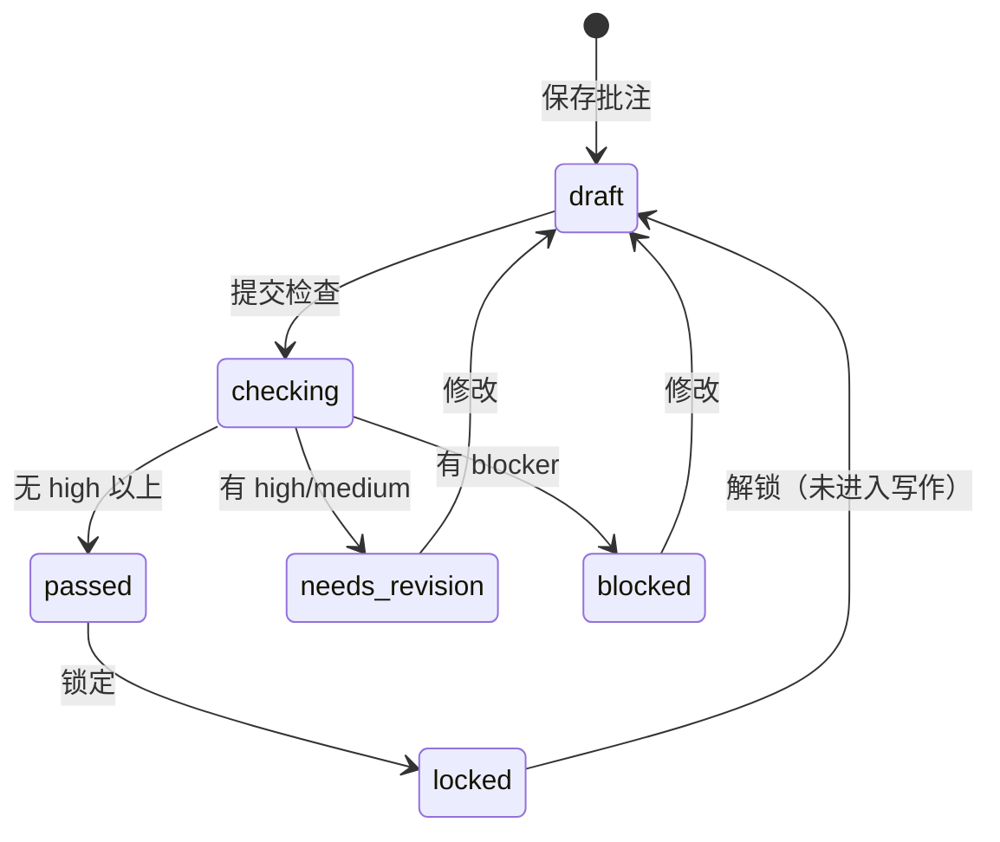

# 06 · 从原型提炼的实现规格

> 输入：`prototype/`（可点击交互原型 v0.1）
> 输出：本文件 → 落到 `apps/api`（表 / 接口）与 `apps/web`（页面）
> 对既有文档的修订：`01` §3.1 三层结构不变；**新增「素材」为中枢对象**，`01` §3.2 核心对象表、`03` §2 主流程、`05` 表结构据此调整。

---

## 1. 需求变更摘要（原型 → 规格）

| # | 变更 | 原设计 | 新设计 | 影响 |
| --- | --- | --- | --- | --- |
| R1 | **新增「素材」（Material）** | 资讯 → 点评 → 选题 | 资讯 →**素材**→（可选）点评 → 选题 → 稿件 | 新增 3 张表；工作台数据源改为素材 |
| R2 | **资讯中心内联完成筛选与批注** | 批量选中 → 跳转工作台 | 在资讯中心就地批注 + 标记素材，**不跳页** | 前端页面重构；批注接口需支持单条 upsert |
| R3 | **素材多维分组** | 无 | `评分 1~10` + `主题（多值标签）` + `日期（默认当天）` | 素材列表需支持三维筛选 |
| R4 | **点评是可选加深，不是前置条件** | M3 起必须 ≥1 条 passed 点评才能写作 | 允许无点评直接写作（素材综述模式），UI 强提示 | 选题写作门槛校验放宽为"有素材即可" |
| R5 | **点评状态机落到 DB** | 文档描述 | `annotations.status` + `annotation_versions` | 新增 2 张表 |
| R6 | **体检报告结构化落库** | `ReviewReport` Pydantic | `review_reports` + `review_findings`，finding 可处置 | 新增 2 张表 + 处置接口 |
| R7 | **事实卡片落库** | 文档描述（M2） | `fact_cards` + `fact_card_claims` | 新增 2 张表 |
| R8 | **选题 = 一组素材** | 选题聚合「资讯 + 点评」 | 选题聚合**素材**（点评随素材带出） | `project_materials` 关联素材而非资讯 |

**不变的原则**（沿用 `docs/README.md` §2）：观点是燃料、事实与观点分离、HITL 主线、一切可追溯、数据源可插拔。

---

## 2. 领域模型

```
User ──┬── Interest(画像)
       ├── NewsAction(收藏/评级/隐藏)          ← M1 已有
       └── Material(素材) ★新增中枢
              ├── MaterialTopic ── Topic(主题标签)
              ├── Annotation(点评, 0..1)        ← 有点评 = 观点驱动
              │      └── AnnotationVersion(版本)
              │      └── ReviewReport(体检报告)
              │             └── ReviewFinding(发现项)
              └── ProjectMaterial ── Project(选题) ── Article(稿件) ── ArticleVersion
NewsItem ── FactCard(事实基线) ── FactCardClaim
PromptTemplate(提示词/技能包)
```

**素材的三维语义**

| 维度 | 类型 | 默认 | 用途 |
| --- | --- | --- | --- |
| `material_date` | date | 当天 | 「每天一个素材组」的天然归档键；工作台/选题的一级筛选 |
| `score` | smallint 1~10 | 5 | 想写的程度；选题「拉入 ≥8 的今日素材」 |
| `topics` | 多值标签 | 空 | 跨日期聚类（"扩产"、"政策"），多维分组的关键 |

---

## 3. 业务流程（状态机）

### 3.1 端到端（12 步，修订 `03` §2）

```
① 后台同步（无人值守）
② 资讯中心：筛选 / 事件簇 / 搜索
③ ★ 标记素材：评分 1~10 + 主题 + 日期（默认当天）
④ ★ 就地批注（资讯中心内联，不跳页）——可选
⑤ 工作台：按 日期/评分/主题 取素材，深化点评
⑥ 提交检查（三轨并行，并发 ≤5）
⑦ 体检报告：划词高亮 · 采纳 / 驳回（必填理由）/ 忽略
⑧ ★ 创建选题：从素材库挑一组素材（不要求有点评）
⑨ AI 写作：素材装载 → 大纲 HITL → 分段流式 → 事实复核
⑩ 编辑定稿：段落重写 · 版本 diff · 导出（含 AI 标识）
⑪ 沉淀：观点入库 · 提示词版本留档 · 成本与改动率
⑫ ★ 无点评路径：③ → ⑧ → ⑨（素材综述模式，UI 强提示）
```

### 3.2 点评（Annotation）



`verdict` 由 finding 派生，规则与 `03` §3 步骤⑦ 一致；**blocker 未处置则禁止进入写作**。

### 3.3 选题（Project）

```
collecting → reviewing → ready → composing → drafting → completed → archived
                              ↘ cancelled（24h 未确认大纲）
```
- `ready` 的判定：**选中素材 ≥ 1**，且**不存在未处置的 blocker**（点评非必需）。

---

## 4. 接口清单（`/api/v1`）

### 4.1 素材与主题

| 方法 | 路径 | 说明 |
| --- | --- | --- |
| `GET` | `/materials` | 列表。参数：`date` `min_score` `max_score` `topic`（可重复）`has_annotation` `limit` `offset`；返回素材 + 资讯摘要 + 批注摘要 |
| `POST` | `/materials` | 标记素材（幂等 upsert）：`{news_id, score, topics[], material_date, note}` |
| `PATCH` | `/materials/{id}` | 改评分 / 主题 / 日期 |
| `DELETE` | `/materials/{id}` | 移出素材库（软删，点评与选题关联保留审计） |
| `GET` | `/materials/stats` | 今日概览：条数 / 已批注 / 平均分 / 按主题分布 / 按评分档分布 |
| `GET` | `/topics` | 主题标签（系统预设 + 我的） |
| `POST` | `/topics` | 新建主题 `{name}` |

### 4.2 批注与检查

| 方法 | 路径 | 说明 |
| --- | --- | --- |
| `GET` | `/materials/{id}/annotation` | 读取该素材的点评（含当前版本、verdict、finding 计数） |
| `PUT` | `/materials/{id}/annotation` | upsert 点评正文；正文变化则生成 `annotation_versions` 新版本 |
| `GET` | `/annotations/{id}/versions` | 版本历史 |
| `POST` | `/annotations/check` | 提交检查：`{material_ids[]}`，同步跑规则版三轨 → 返回 run + reports |
| `GET` | `/reviews/{report_id}` | 报告详情（findings 按 severity 排序） |
| `POST` | `/reviews/findings/{finding_id}/resolve` | 处置：`{action: accepted|dismissed|ignored, reason?}`；`dismissed` 必填 reason |

### 4.3 事实卡片

| 方法 | 路径 | 说明 |
| --- | --- | --- |
| `GET` | `/news/{news_id}/fact-card` | 事实基线（claims + evidence + open_questions） |
| `PUT` | `/news/{news_id}/fact-card` | 写入/更新（ResearcherAgent 的落库入口） |

### 4.4 选题

| 方法 | 路径 | 说明 |
| --- | --- | --- |
| `GET` | `/projects` | 列表（含素材数 / 带点评数 / 是否含红线） |
| `POST` | `/projects` | 创建：`{title?, platform?, material_ids[], prompt_ids[]}` |
| `GET` | `/projects/{id}` | 详情：素材、提示词、可写作性 `writable` + `blocking_reasons[]` |
| `PATCH` | `/projects/{id}` | 改标题 / 平台 / 字数 / 要求 / 提示词 |
| `POST` | `/projects/{id}/materials` | 加素材 `{material_ids[]}` |
| `DELETE` | `/projects/{id}/materials/{material_id}` | 移除素材 |
| `POST` | `/projects/{id}/compose` | 触发写作（M3 占位：返回 run，写 `agent_runs`） |

### 4.5 提示词

| 方法 | 路径 | 说明 |
| --- | --- | --- |
| `GET` | `/prompts` | 提示词模板（官方 + 我的，按 category 分组） |
| `POST` | `/prompts` | 新建（自动 +1 版本） |

### 4.6 M1 既有接口的调整

| 接口 | 变更 |
| --- | --- |
| `GET /news` | 每条附 `material`（评分/主题/日期）与 `annotation`（status/verdict），前端一屏内即可渲染徽标 |
| `GET /news/{id}` | 同上 + `fact_card` 摘要 |
| `POST /news/{id}/actions` | 不变 |

---

## 5. 数据库表结构（迁移 `0003`，新增 14 张表）

> 约定沿用 `05-database-schema.md` §1：uuid 主键、`timestamptz`、软删 `deleted_at`、唯一性一律用**部分唯一索引**。

### 5.1 素材与主题

```sql
topics(id, user_id?, slug, name, color?, is_system, created_at, updated_at, deleted_at)
  -- 双部分唯一：系统预设 (slug) WHERE user_id IS NULL；用户自建 (user_id, slug) WHERE deleted_at IS NULL

materials(id, user_id, news_item_id, material_date DATE DEFAULT CURRENT_DATE,
          score SMALLINT CHECK 1..10 DEFAULT 5, status, note?, created_at, updated_at, deleted_at)
  -- uq(user_id, news_item_id) WHERE deleted_at IS NULL   一条资讯最多一个素材
  -- ix(user_id, material_date DESC) / ix(user_id, score DESC) / ix(news_item_id)

material_topics(material_id, topic_id, created_at)  PK(material_id, topic_id)
```

### 5.2 点评与版本

```sql
annotations(id, user_id, material_id, news_item_id, status, body TEXT DEFAULT '',
            current_version_no INT DEFAULT 0, last_checked_at?, created_at, updated_at, deleted_at)
  -- uq(material_id) WHERE deleted_at IS NULL

annotation_versions(id, annotation_id, version_no, body, source, created_at)
  -- uq(annotation_id, version_no)
```

### 5.3 事实基线

```sql
fact_cards(id, news_item_id UNIQUE, context_notes, related_symbols TEXT[], open_questions JSONB,
           status, model?, generated_at?, created_at, updated_at)

fact_card_claims(id, card_id, seq, claim, status, confidence NUMERIC(3,2), evidence JSONB, created_at)
  -- uq(card_id, seq)
```

### 5.4 体检报告

```sql
review_reports(id, user_id, annotation_id, annotation_version_no, run_id?, verdict,
               summary, findings_count, created_at, updated_at)

review_findings(id, report_id, track, severity, status, span_start, span_end, quote,
                message, suggestion, evidence JSONB, reason?, resolved_at?, created_at, updated_at)
  -- ix(report_id, severity)；ix(status) WHERE status='open'
```

### 5.5 选题 / 提示词 / 稿件

```sql
projects(id, user_id, title, status, platform?, target_words?, require_note?,
         prompt_ids JSONB, compose_run_id?, created_at, updated_at, deleted_at)
project_materials(project_id, material_id, role, sort, created_at)  PK(project_id, material_id)

prompt_templates(id, user_id?, name, category, version_no, description?, body, variables TEXT[],
                 is_official, created_at, updated_at, deleted_at)

articles(id, user_id, project_id?, title, status, current_version_no, platform?, created_at, updated_at, deleted_at)
article_versions(id, article_id, version_no, title, content, citation_map JSONB, source, word_count, created_at)
```

新增枚举：`material_status` `annotation_status` `annotation_version_source` `fact_status` `report_verdict`
`finding_track` `finding_severity` `finding_status` `project_status` `project_material_role`
`prompt_category` `article_status` `article_version_source`。

**表计数**：M1 的 16 张 + 14 张 = **30 张**（`05` 文档的 36 张含视图/预留，差异在文档中标注）。

---

## 6. 前端页面与路由

| 路由 | 页面 | 对应步骤 | 关键交互 |
| --- | --- | --- | --- |
| `/` | 今日收件箱 | ② | 今日素材统计、待办、兴趣召回 |
| `/news` | **资讯中心** | ②③④ | 三视图（全部/素材/待批注）、**内联标记素材**（评分/主题/日期）、**内联批注**、批量操作 |
| `/news/:id` | 资讯详情 | ② | 全文 + 事件簇各源差异 + FactCard |
| `/workbench` | 点评工作台 | ⑤⑥ | 素材筛选（日期/评分/主题）、编辑器、提交检查 |
| `/reviews` | 体检报告 | ⑦ | 划词高亮、采纳/驳回（必填理由）、verdict |
| `/projects` | 选题 | ⑧ | 素材选择器、写作门槛、无点评提示 |
| `/projects/:id/compose` | AI 写作 | ⑨ | 素材装载 → 大纲 HITL → 流式（M3 占位） |
| `/prompts` | 提示词 | — | 分类分组、版本号、新建（官方模板库已 seed） |
| `/settings/connectors` | 数据源 | ① | 权限探测、手动同步、同步日志 |

> 兴趣画像页**未实现**：`user_interests` 表已存在（M1），但召回排序与画像 CRUD 接口尚未交付，
> 前端不画假界面，留待 M2 收尾或 M3。

---

## 7. 本次实施范围

**已实现**
- 后端：迁移 0003（14 表）、models/repositories/services、`materials` `topics` `annotations` `reviews` `projects` `prompts` 路由、`news` 列表附素材/批注摘要
- 检查引擎：**规则版**三轨（fact 走 FactCard 数值比对 / logic 绝对化词表 / compliance 红线词库），
  接口与 finding 结构按最终形态定义，后续替换为 ReviewerAgent 不改表与接口
- 前端：资讯中心（内联标记素材 + 内联批注）、工作台、体检报告、选题

**未实现（保持占位）**
- SSE 流式与 `agent_runs` 的 LangGraph 编排（M2/M3）
- FactCard 的自动生成入口（仅提供写接口，等待 ResearcherAgent）
- 写作台的实际生成（`POST /projects/{id}/compose` 只建 run）
- 兴趣画像的自学习、观点库、多平台改写（M4）
